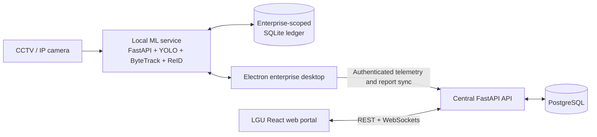

# TANAW

TANAW is a tourism monitoring, enterprise reporting, and LGU operations platform
for the City of San Pedro, Laguna. It connects participating enterprises to the
city through a local desktop application that can count visitors from CCTV/IP
camera streams, keep an offline-capable local ledger, and submit periodic
reports. LGU personnel use the web portal to manage accounts, monitor enterprise
and desktop app status, review submissions, analyze visitor activity, and produce
consolidated city reports.

The system keeps computer-vision processing at the enterprise edge. Camera
frames are processed by the local desktop ML service; the central backend
receives operational metrics, report submissions, and workflow events rather
than the raw camera stream.

Want only the commands needed to test the system? Use the
[TL;DR test guide](./TLDR.md).

## Contents

- [TL;DR test guide](./TLDR.md)
- [What TANAW provides](#what-tanaw-provides)
- [Architecture](#architecture)
- [Technology stack](#technology-stack)
- [Project structure](#project-structure)
- [Prerequisites](#prerequisites)
- [Terminal compatibility](#terminal-compatibility)
- [Quick start](#quick-start)
- [Default and temporary accounts](#default-and-temporary-accounts)
- [Load sample report data](#load-sample-report-data)
- [Optional host-run development](#optional-host-run-development)
- [Production-like Docker build](#production-like-docker-build)
- [Environment configuration](#environment-configuration)
- [Local desktop data](#local-desktop-data)
- [Development checks](#development-checks)
- [Troubleshooting](#troubleshooting)

## What TANAW provides

### Enterprise desktop

The Electron desktop application is intended for registered tourism and local
enterprise operators. It provides:

- enterprise authentication and enterprise-scoped local storage;
- CCTV/IP camera registration, connection testing, and live monitoring;
- YOLO11-based person detection, ByteTrack/BoT-SORT tracking, and tripwire entry/exit
  counting;
- privacy-conscious unique visitor estimation using local person ReID rather
  than facial recognition;
- local SQLite persistence for events, metrics, visitor identity metadata, and
  report drafts;
- offline-first report submission with retryable synchronization to the central
  API;
- current and historical metrics, occupancy, reports, notifications, profile,
  and security settings.

The Electron process starts and supervises the local Python ML service on
`127.0.0.1:8765`. A real camera is optional when using backend-prepared sample
counts.

### LGU web portal

The React web portal exposes role-specific workspaces:

- **IT Personnel** — operational dashboard, LGU and enterprise account
  management, alerts, system logs, development delivery log, and system
  settings.
- **Admin** — enterprise map view, alerts monitoring, and centralized system
  logs.
- **LGU Staff** — tourism analytics, enterprise batch-report review, final
  report generation/audit, and system logs.

### Backend platform

The FastAPI backend provides authentication, account administration,
enterprise operational synchronization, activity logs, report review, final
report consolidation, WebSocket updates, and guarded test-data tooling.

## Architecture



The main data flow is:

1. The local ML service reads the configured camera stream and records counts
   and report data in the enterprise's local SQLite ledger.
2. The Electron desktop remains usable through temporary network failures and
   periodically retries cloud synchronization.
3. The desktop sends telemetry every few seconds and uploads pending report
   submissions to the central API.
4. The backend stores enterprise, telemetry, report, final-report, and audit
   records in PostgreSQL.
5. The web portal consumes the API and authenticated WebSocket feeds for LGU
   monitoring and reporting workflows.

Raw camera video is not uploaded to PostgreSQL. ReID processing and temporary
appearance metadata stay on the enterprise device.

## Technology stack

| Area                 | Technologies                                                                                             |
| -------------------- | -------------------------------------------------------------------------------------------------------- |
| Web portal           | React 19, TypeScript 6, Vite 8, Tailwind CSS 4, React Router, TanStack Query, Zustand, Recharts, Leaflet |
| Desktop app          | Electron 42, React 18, TypeScript, Vite, Tailwind CSS, TanStack Query, Zustand                           |
| Local ML service     | Python 3.12+, FastAPI, OpenCV, Ultralytics YOLO11, ByteTrack/BoT-SORT, OpenVINO, ONNX Runtime, SQLite    |
| Backend API          | Python 3.14, FastAPI, SQLAlchemy, asyncpg, Alembic, JWT, Argon2                                          |
| Database             | PostgreSQL 17                                                                                            |
| Local orchestration  | Docker Compose                                                                                           |
| Production web image | Nginx serving the compiled Vite application                                                              |

## Project structure

```text
TANAW/
├── backend-tanaw/              # Central FastAPI API and PostgreSQL models
│   ├── app/
│   │   ├── api/                # Top-level API router composition
│   │   ├── core/               # Configuration, security, and shared policies
│   │   ├── db/                 # SQLAlchemy engine, sessions, and metadata
│   │   └── features/
│   │       ├── accounts/       # LGU/enterprise accounts and bootstrap seed
│   │       ├── activity_logs/  # Audit and operational activity
│   │       ├── auth/           # Login, logout, password, and recovery flows
│   │       ├── sample_data/    # Development sample-data CLI
│   │       └── operational/    # Telemetry, reports, sync, and final reports
│   ├── alembic/                # Database migrations
│   └── tests/
├── frontend-tanaw/             # LGU role-based React web portal
│   └── src/
│       ├── app/                # Router, providers, and stores
│       ├── features/           # IT, Admin, Staff, reporting, and analytics
│       └── shared/             # API clients, hooks, UI, types, and utilities
├── desktop-tanaw/              # Enterprise Electron application
│   ├── electron/               # Main process and preload bridge
│   ├── src/                    # React renderer and enterprise workflows
│   └── ml-service/             # Local Python camera/ML service and SQLite data
├── docker-compose.yml          # Development database, API, and web portal
├── docker-compose.prod.yml     # Production-like API and compiled web portal
└── .env                        # Root Compose environment; keep this private
```

Component-specific documentation:

- [Backend overview](./backend-tanaw/README.md)
- [Frontend web portal overview](./frontend-tanaw/README.md)
- [Enterprise desktop and local data details](./desktop-tanaw/README.md)

## Prerequisites

For the web portal, backend, and database:

- Git
- Docker Engine or Docker Desktop with Docker Compose
- on Windows, Docker Desktop using Linux containers (the WSL 2 backend is
  recommended)

For desktop development:

- Node.js `22.12.0` or newer and npm
- Python `3.12` or newer for the local ML service
- [uv](https://docs.astral.sh/uv/)
- optional CCTV, RTSP, HTTP, or local camera source for live counting

The supported Windows development target is 64-bit Windows 10 or 11 on an
x86-64 computer. The Electron packaging target and native ML dependency wheels
in the current lockfile are Windows x64. Windows on ARM is not currently a
supported desktop-development target.

Docker is the primary setup path for PostgreSQL, the backend API, and the web
portal. The Electron desktop intentionally runs on the host so it can access
native desktop features, local storage, ML models, and camera streams.

## Terminal compatibility

The main commands in this README work in:

- Linux/macOS shells such as Bash and Zsh;
- Windows PowerShell, which is the recommended Windows terminal;
- Windows Command Prompt for the single-line Docker, npm, and uv commands.

Commands are intentionally written on one line where shell continuation syntax
would differ. Do not copy a trailing Bash `\` into PowerShell or Command Prompt.

Directory changes (`cd`), `docker compose`, `npm`, and `uv` use the same syntax
on all supported platforms. File-copying and a few HTTP inspection commands
have separate examples where needed.

Git Bash or WSL can also run the Linux examples on Windows, but they are not
required. Run the Docker commands from the repository root and the desktop
commands from the directory stated above each block.

For the smoothest Windows setup, clone the repository into a short,
non-synchronized path such as `C:\dev\TANAW`. Deep paths and OneDrive-managed
folders can cause avoidable Node/Electron path or file-locking problems.

## Quick start

### 1. Verify the installed tools

Open a new terminal after installing the prerequisites, then run:

```shell
git --version
docker compose version
```

Docker Desktop must be running before `docker compose` commands will work.

If you will also run the enterprise desktop locally, verify Node.js, npm, and
uv:

```shell
node --version
npm --version
uv --version
```

Node.js must report `v22.12.0` or newer.

The backend pins Python 3.14. The desktop ML service supports Python 3.12 or
newer; using Python 3.14 across the repo is the simplest local default. Allow
uv to install it before the first dependency sync:

```shell
uv python install 3.14
```

This command is the same in Linux, macOS, and Windows PowerShell.

### 2. Configure the root environment

If `.env` does not already exist, copy the committed template from the
repository root.

Linux/macOS:

```shell
test -f .env || cp .env.example .env
```

Windows PowerShell:

```powershell
if (-not (Test-Path .env)) { Copy-Item .env.example .env }
```

Windows Command Prompt:

```bat
if not exist .env copy .env.example .env
```

Generate a cryptographically secure JWT secret and copy the printed value into
`JWT_SECRET_KEY` in `.env`. Generate a different secret for every environment
and never commit it.

Linux:

```shell
openssl rand -base64 48
```

Windows PowerShell:

```powershell
$bytes = New-Object byte[] 48
$rng = [System.Security.Cryptography.RandomNumberGenerator]::Create()
try {
    $rng.GetBytes($bytes)
    [Convert]::ToBase64String($bytes)
} finally {
    $rng.Dispose()
}
```

Open `.env` in a text editor and replace the sample PostgreSQL password and JWT
secret. Use the same PostgreSQL password in `POSTGRES_PASSWORD` and inside
`DATABASE_URL`. The root template intentionally contains only local credentials
and the optional Resend settings developers commonly change:

```dotenv
POSTGRES_DB=TanawDB
POSTGRES_USER=postgres
POSTGRES_PASSWORD=change-this-local-password
POSTGRES_HOST_PORT=5433
DATABASE_URL=postgresql+asyncpg://postgres:change-this-local-password@db:5432/TanawDB
JWT_SECRET_KEY=replace-this-with-a-long-random-secret

BOOTSTRAP_IT_USERNAME=default@email.com
BOOTSTRAP_IT_PASSWORD=default
TANAW_SEED_DEVELOPMENT_ACCOUNTS=true
DEVELOPMENT_ADMIN_USERNAME=admin@email.com
DEVELOPMENT_ADMIN_PASSWORD=admin123
DEVELOPMENT_STAFF_USERNAME=staff@email.com
DEVELOPMENT_STAFF_PASSWORD=staffstaff
DEVELOPMENT_IT_USERNAME=it@email.com
DEVELOPMENT_IT_PASSWORD=it123456

EMAIL_DELIVERY_MODE=log
RESEND_API_KEY=
EMAIL_FROM_ADDRESS=onboarding@resend.dev
EMAIL_TEST_RECIPIENT=
```

Use the Compose hostname `db` in `DATABASE_URL`; `localhost` would point back
to the backend container. Keep `.env` private and use a strong database password
and JWT secret outside disposable local development. The root `.gitignore`
excludes `.env`; commit `.env.example`, never the populated `.env`.
Local URLs, ports, token lifetimes, polling, cooldowns, and retention policies
use the defaults maintained in the codebase and do not need entries here.

To inspect the local database with DBeaver, create a PostgreSQL connection using
host `localhost`, port `5432`, and the database, username, and password from
`POSTGRES_DB`, `POSTGRES_USER`, and `POSTGRES_PASSWORD`. The database is bound
only to localhost.
Keep `DATABASE_URL` on `db:5432` because the backend connects from inside the
Compose network.

### 3. Start the database, API, and web portal

From the repository root:

```shell
docker compose up --build -d
```

Open:

- Web portal: <http://localhost:5173>
- Backend health: <http://localhost:8000/health>
- Interactive API documentation: <http://localhost:8000/docs>

Follow logs when needed:

```shell
docker compose logs -f backend frontend
```

Stop the services without deleting database data:

```shell
docker compose down
```

Compose applies every versioned Alembic migration before the backend starts.
The backend validates that migration state, initializes the bootstrap IT account
once, and optionally creates explicitly enabled development accounts. Later
restarts never mutate the schema or synchronize or reset an existing account.

### 4. Install and start the enterprise desktop

The desktop is only required for camera monitoring and the complete
enterprise-to-LGU reporting workflow. It is not run through Docker.

```shell
cd desktop-tanaw
npm ci
uv sync --directory ml-service --frozen
npm run models:setup
npm run dev
```

`npm run models:setup` installs all supported YOLO11 detector assets. For
CPU/OpenVINO testing, use `npm run models:setup:openvino` from `desktop-tanaw`.

`npm run dev` starts the Electron development app. Electron then starts the
local ML service automatically and uses the central API at
`http://localhost:8000` by default.

To run an already-built desktop application:

```shell
npm run build
npm start
```

To create a platform installer or package:

```shell
npm run dist
```

Build artifacts are written under `desktop-tanaw/release/`.

The current installer build includes the TANAW desktop code and ML service
source, but local model artifacts are not committed to Git. A build machine
must run the model setup command first if installer packaging should include
those assets. It does not bundle a standalone Python runtime and installed
Python packages. A machine running that development installer still needs
Python 3.12 or newer and uv available. Group members cloning the repository
should use `npm run dev`, which uses the `.venv` created by
`uv sync --directory ml-service --frozen`.

## Bootstrap and development accounts

On a fresh local database, the backend creates the bootstrap IT account once:

```text
Role: IT Personnel
Username: default@email.com
Password: default
```

When `TANAW_SEED_DEVELOPMENT_ACCOUNTS=true`, it also creates these local-only
development accounts once:

```text
Role: Admin
Username: admin@email.com
Password: admin123

Role: LGU Staff
Username: staff@email.com
Password: staffstaff

Role: IT Personnel
Username: it@email.com
Password: it123456
```

Use the bootstrap or development IT account to create and manage LGU and
enterprise accounts during local development. The one-time bootstrap comes from
`BOOTSTRAP_IT_*`; optional development accounts come from the
`DEVELOPMENT_ADMIN_*`, `DEVELOPMENT_STAFF_*`, and `DEVELOPMENT_IT_*` settings.

After an account exists, changing these environment values does not modify its
password, email, role, status, activation state, or lockout state. Production
rejects development account seeding and placeholder JWT/bootstrap credentials.
For a fresh production database, configure a unique bootstrap email and password
for the first startup. After initialization, remove `BOOTSTRAP_IT_*` from the
deployment secrets. TANAW persists the bootstrap account's protected identity in
the database, so removing those variables never makes the account editable or
deactivatable. If an IT account already exists in a migrated database, no
bootstrap credentials are required.

## Load sample report data

TANAW includes a development-only sample-data CLI for demonstrations, QA, and
end-to-end reporting tests. It inserts ordinary application rows into the
canonical tables; the production schema has no mock-data table, provenance
column, or compatibility model.

Before loading the dataset, create and activate the persistent target account
through **IT Portal > Enterprise Accounts**. The wrappers default to:

```text
Enterprise:    Archie's Event Place
Email:         archies@email.com
Enterprise ID: archies_001@tanaw.sanpedro
```

Confirm the actual Enterprise ID in the account details or desktop Profile.
Then, from the repository root:

```shell
./scripts/mockdata-on
```

PowerShell:

```powershell
.\scripts\mockdata-on.ps1
```

The command creates three sample LGU accounts, five supporting enterprise
accounts, telemetry, historical submissions, final reports, notifications, and
activity logs. It also exposes deterministic previous-period and current-period
count packages for the persistent target enterprise. Archie's account and
enterprise profile are never generated or deleted by these commands.

All generated accounts use:

```text
Password: Visitor sample access phrase 2026
```

Useful accounts include `reports.staff@tanaw.test`,
`system.admin@tanaw.test`, and `it.operations@tanaw.test`.

Show whether the deterministic sample accounts are present:

```shell
./scripts/mockdata-status
```

Refresh the dataset by removing its reserved deterministic identifiers and
inserting it again:

```shell
./scripts/mockdata-reset
```

Remove the central sample dataset:

```shell
./scripts/mockdata-off
```

The cleanup command identifies sample records by the dataset's reserved account
emails, IDs, report-code prefixes, camera prefix, and ordinary relationships.
It does not depend on database columns or a tracking table. Because there is no
row-level provenance, do not reuse these reserved identifiers for real records.

Desktop counts are stored in the enterprise-scoped local SQLite ledger and are
intentionally independent of PostgreSQL cleanup. To clear those local rows,
close the desktop and run `./scripts/local-mockdata-off`. That command removes
all local ledger rows—including real camera-derived rows—while preserving
camera settings, authentication storage, preferences, and Electron caches.

To use a different target or range:

```shell
TANAW_MOCK_TARGET_ENTERPRISE="actual_enterprise_id" TANAW_MOCK_RANGE=12m ./scripts/mockdata-on
```

Supported ranges are `30d`, `6m`, and `12m`. Supported datasets are
`full-workflow`, `peak-traffic`, and `camera-health`.

## Optional host-run development

Docker Compose is the recommended setup for PostgreSQL, the backend, and the
web portal. Use host-run backend or frontend commands only when you are
debugging a service directly, changing dependency behavior, or working without
Compose.

### Backend API

Start a local PostgreSQL server and create the configured database. Then:

Linux/macOS:

```shell
cd backend-tanaw
uv sync --frozen
uv run alembic upgrade head
uv run uvicorn main:app --reload
```

Windows PowerShell:

```powershell
Set-Location backend-tanaw
uv sync --frozen
uv run alembic upgrade head
uv run uvicorn main:app --reload
```

Windows Command Prompt:

```bat
cd backend-tanaw
uv sync --frozen
uv run alembic upgrade head
uv run uvicorn main:app --reload
```

Before starting a host-run backend, export the relevant development values from
the root `.env`, changing `DATABASE_URL` to use `localhost` instead of the Docker
service hostname `db`. The backend `.env.example` is production-only and should
not be copied for local development.

### Web portal

```shell
cd frontend-tanaw
npm ci
printf 'VITE_API_BASE_URL=http://localhost:8000\n' > .env.local
npm run dev
```

PowerShell:

```powershell
Set-Location frontend-tanaw
npm ci
Set-Content -Path .env.local -Value "VITE_API_BASE_URL=http://localhost:8000"
npm run dev
```

### Local ML service by itself

Electron normally supervises this service. For isolated development:

```shell
cd desktop-tanaw
cd ml-service
uv sync --frozen
uv run python main.py
```

The service listens on <http://127.0.0.1:8765> by default. Its health endpoint
is <http://127.0.0.1:8765/health>.

## Production-like Docker build

Use the production Compose file for deployment-like local validation:

```shell
docker compose -f docker-compose.prod.yml up --build -d
```

This configuration:

- installs production-only backend dependencies;
- runs a one-shot migration service and starts the API only after it succeeds;
- runs Uvicorn without reload;
- compiles the web portal during image creation;
- serves the compiled frontend through Nginx;
- embeds `VITE_API_BASE_URL` into the web build.

The Electron desktop is not containerized and must still run on the host or be
installed from a packaged desktop build.

For non-Compose deployments, run `uv run alembic upgrade head` as the platform's
pre-deploy or release command before replacing the backend process. TANAW refuses
to start against an uninitialized or outdated database. The canonical baseline
starts a new migration history, so existing pre-release databases must be backed
up and recreated before deployment.

## Environment configuration

The repository keeps development and production configuration separate:

- The root `.env.example` is the Docker Compose development template. It
  contains local database and account credentials plus optional Resend testing.
- `backend-tanaw/.env.example` is the backend production template.
- `frontend-tanaw/.env.example` is the frontend production template.

The backend production template contains only deployment-specific values:

| Variable | Purpose |
| --- | --- |
| `TANAW_ENV` | Enables production validation |
| `DATABASE_URL` | Managed PostgreSQL connection URL |
| `JWT_SECRET_KEY` | Token-signing secret |
| `CORS_ORIGINS` | Authorized public frontend origin |
| `FRONTEND_PUBLIC_URL` | Public URL used in transactional links |
| `BOOTSTRAP_IT_USERNAME`, `BOOTSTRAP_IT_PASSWORD` | One-time credentials for an empty database |
| `EMAIL_DELIVERY_MODE` | Selects production Resend delivery |
| `RESEND_API_KEY` | Backend-only Resend credential |
| `EMAIL_SECRET_DERIVATION_KEY` | Separate secret for activation and recovery values |
| `EMAIL_FROM_ADDRESS` | Sender on a verified domain |

The frontend production template contains only `VITE_API_BASE_URL`, which is
compiled into the browser bundle. Vercel supplies its own production marker;
other public build systems should set `TANAW_PUBLIC_DEPLOYMENT=true` in their
build configuration to enable the same public-URL validation.

Ports, local origins, JWT algorithm and lifetime, provider endpoints, request
timeouts, polling and lease behavior, rate limits, cooldowns, token lifetimes,
and retention policies use validated defaults maintained in
`backend-tanaw/app/core/config.py` or the relevant Compose/application code.
They are intentionally omitted from the templates so routine deployments expose
only values operators genuinely need to supply.

Sample-data commands reject production environments.

## Local desktop data

Desktop records are separate from PostgreSQL and are scoped by enterprise.
Close the desktop app before manually clearing local data.

Remove all local desktop ledger data, including real CCTV-derived rows,
demographic report drafts, submitted reports, snapshots, and occupancy corrections, while
preserving saved camera settings, authentication storage, preferences, and
Electron caches:

```shell
./scripts/local-mockdata-off
```

PowerShell: `.\scripts\local-mockdata-off.ps1`

The script does not remove backend data. Run `./scripts/mockdata-off` separately
when the central sample dataset should also be removed.

Inspect all local ledgers:

```shell
cd desktop-tanaw
npm run local-data -- inspect
```

Inspect one enterprise:

```shell
npm run local-data -- inspect --enterprise "archies_001@tanaw.sanpedro"
```

Clear one enterprise ledger:

```shell
npm run local-data -- clear --enterprise "archies_001@tanaw.sanpedro" --yes
```

The local-data CLI expects the Enterprise ID shown in the desktop Profile, not
the account email. Run the unfiltered `inspect` command first if the generated
ID uses a different sequence number.

Clear every enterprise ledger while preserving Electron preferences and saved
camera definitions:

```shell
npm run local-data -- clear --all-ledgers --yes
```

Perform a full device reset, including camera definitions, authentication
storage, preferences, and Electron caches:

```shell
npm run local-data -- clear --full-device --yes
```

See [desktop-tanaw/README.md](./desktop-tanaw/README.md) for platform paths and
additional inspection options.

## Development checks

Run the checks for every project affected by a change.

Backend:

```shell
cd backend-tanaw
uv run ruff check .
uv run ruff format --check .
uv run mypy .
uv run pyright
```

Web portal:

```shell
cd frontend-tanaw
npm run lint
npm run type
```

Desktop:

```shell
cd desktop-tanaw
npm run lint
npm run type
```

Desktop ML service:

```shell
cd desktop-tanaw
cd ml-service
uv run ruff check .
uv run ruff format --check .
uv run mypy .
uv run pyright
```

## Troubleshooting

### A port is already in use

Check whether the existing process is already the TANAW service before starting
another copy:

```shell
docker compose ps
```

The normal ports are `5173` for the web portal, `8000` for the backend, `5174`
for the desktop renderer, and `8765` for the local ML service.

### PowerShell says script execution is disabled

Some Windows installations block the `npm.ps1` launcher. Use the executable
command shims without changing the machine-wide execution policy:

```powershell
npm.cmd ci
npm.cmd run dev
```

If `uv` or another newly installed command is not recognized, close and reopen
PowerShell so the updated `PATH` is loaded.

### Docker Desktop is installed but Compose cannot start

- Start Docker Desktop and wait until its engine reports that it is running.
- Confirm Docker Desktop is using Linux containers.
- Enable hardware virtualization and the WSL 2 backend if Docker Desktop asks
  for them.
- Run `docker compose version`, followed by `docker compose ps`.

### Windows dependency installation fails with a long-path error

Move the clone to a shorter path such as `C:\dev\TANAW` and rerun `npm ci` or
`uv sync --frozen`. Avoid placing the development checkout inside OneDrive or
another actively synchronized folder.

### The backend cannot connect to PostgreSQL

- In Docker, verify that `DATABASE_URL` uses `db:5432`.
- On the host, verify that it uses `localhost` or the actual database host.
- If PostgreSQL credentials changed after the Docker volume was created, either
  restore the old credentials or intentionally recreate the volume with
  `docker compose down -v`.

### The desktop does not receive prepared counts

- Sign in as the exact enterprise selected with `--target-enterprise`.
- Keep the backend and desktop running for several seconds so the authenticated
  polling cycle can complete.
- Restart the desktop after ML-service code or dependency changes.
- Check local state on Linux/macOS with:

  ```shell
  curl http://127.0.0.1:8765/metrics/summary
  ```

- On Windows PowerShell, use:

  ```powershell
  Invoke-RestMethod http://127.0.0.1:8765/metrics/summary
  ```

### A sample account already exists

The sample command refuses to overwrite an existing account with a reserved
sample email. Run `sample-data off` to remove the deterministic sample dataset,
or resolve the conflicting account intentionally before loading it again.

### Source changes are not reflected in Docker

Development Compose bind-mounts the backend and frontend and runs their reload
servers. After dependency changes, restart the affected service:

```shell
docker compose restart backend
docker compose restart frontend
```

After Dockerfile or base-image changes, rebuild:

```shell
docker compose up --build -d
```
