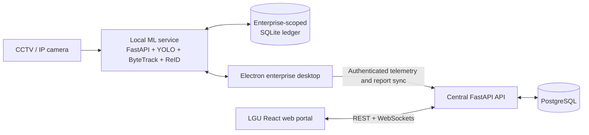

# TANAW

TANAW is a tourism monitoring, enterprise reporting, and LGU operations platform
for the City of San Pedro, Laguna. It connects participating enterprises to the
city through a local desktop application that can count visitors from CCTV/IP
camera streams, keep an offline-capable local ledger, and submit periodic
reports. LGU personnel use the web portal to manage accounts, monitor enterprise
and desktop app status, review submissions, analyze visitor activity, and produce
consolidated city reports.

The system keeps computer-vision processing at the enterprise edge. Camera
frames are processed by the local desktop ML service; the central backend
receives operational metrics, report submissions, and workflow events rather
than the raw camera stream.

Want only the commands needed to test the system? Use the
[TL;DR test guide](./TLDR.md).

## Contents

- [TL;DR test guide](./TLDR.md)
- [What TANAW provides](#what-tanaw-provides)
- [Architecture](#architecture)
- [Technology stack](#technology-stack)
- [Project structure](#project-structure)
- [Prerequisites](#prerequisites)
- [Terminal compatibility](#terminal-compatibility)
- [Quick start](#quick-start)
- [Default and temporary accounts](#default-and-temporary-accounts)
- [Seed and simulate reports](#seed-and-simulate-reports)
- [Remove simulated data](#remove-simulated-data)
- [Optional host-run development](#optional-host-run-development)
- [Production-like Docker build](#production-like-docker-build)
- [Environment configuration](#environment-configuration)
- [Local desktop data](#local-desktop-data)
- [Development checks](#development-checks)
- [Troubleshooting](#troubleshooting)

## What TANAW provides

### Enterprise desktop

The Electron desktop application is intended for registered tourism and local
enterprise operators. It provides:

- enterprise authentication and enterprise-scoped local storage;
- CCTV/IP camera registration, connection testing, and live monitoring;
- YOLO11-based person detection, ByteTrack/BoT-SORT tracking, and tripwire entry/exit
  counting;
- privacy-conscious unique visitor estimation using local person ReID rather
  than facial recognition;
- local SQLite persistence for events, metrics, visitor identity metadata, and
  report drafts;
- offline-first report submission with retryable synchronization to the central
  API;
- current and historical metrics, occupancy, reports, notifications, profile,
  and security settings.

The Electron process starts and supervises the local Python ML service on
`127.0.0.1:8765`. A real camera is optional for the simulated reporting
workflow.

### LGU web portal

The React web portal exposes role-specific workspaces:

- **IT Personnel** — operational dashboard, LGU and enterprise account
  management, alerts, system logs, development delivery log, and system
  settings.
- **Admin** — enterprise map view, alerts monitoring, and centralized system
  logs.
- **LGU Staff** — tourism analytics, enterprise batch-report review, final
  report generation/audit, and system logs.

### Backend platform

The FastAPI backend provides authentication, account administration,
enterprise operational synchronization, activity logs, report review, final
report consolidation, WebSocket updates, and guarded test-data tooling.

## Architecture



The main data flow is:

1. The local ML service reads the configured camera stream and records counts
   and report data in the enterprise's local SQLite ledger.
2. The Electron desktop remains usable through temporary network failures and
   periodically retries cloud synchronization.
3. The desktop sends telemetry every few seconds and uploads pending report
   submissions to the central API.
4. The backend stores enterprise, telemetry, report, final-report, and audit
   records in PostgreSQL.
5. The web portal consumes the API and authenticated WebSocket feeds for LGU
   monitoring and reporting workflows.

Raw camera video is not uploaded to PostgreSQL. ReID processing and temporary
appearance metadata stay on the enterprise device.

## Technology stack

| Area                 | Technologies                                                                                             |
| -------------------- | -------------------------------------------------------------------------------------------------------- |
| Web portal           | React 19, TypeScript 6, Vite 8, Tailwind CSS 4, React Router, TanStack Query, Zustand, Recharts, Leaflet |
| Desktop app          | Electron 42, React 18, TypeScript, Vite, Tailwind CSS, TanStack Query, Zustand                           |
| Local ML service     | Python 3.12+, FastAPI, OpenCV, Ultralytics YOLO11, ByteTrack/BoT-SORT, OpenVINO, ONNX Runtime, SQLite    |
| Backend API          | Python 3.14, FastAPI, SQLAlchemy, asyncpg, Alembic, JWT, Argon2                                          |
| Database             | PostgreSQL 17                                                                                            |
| Local orchestration  | Docker Compose                                                                                           |
| Production web image | Nginx serving the compiled Vite application                                                              |

## Project structure

```text
TANAW/
├── backend-tanaw/              # Central FastAPI API and PostgreSQL models
│   ├── app/
│   │   ├── api/                # Top-level API router composition
│   │   ├── core/               # Configuration, security, and shared policies
│   │   ├── db/                 # SQLAlchemy engine, sessions, and metadata
│   │   └── features/
│   │       ├── accounts/       # LGU/enterprise accounts and bootstrap seed
│   │       ├── activity_logs/  # Audit and operational activity
│   │       ├── auth/           # Login, logout, password, and recovery flows
│   │       ├── mock_data/      # Explicit simulation CLI
│   │       └── operational/    # Telemetry, reports, sync, and final reports
│   ├── alembic/                # Database migrations
│   └── tests/
├── frontend-tanaw/             # LGU role-based React web portal
│   └── src/
│       ├── app/                # Router, providers, and stores
│       ├── features/           # IT, Admin, Staff, reporting, and analytics
│       └── shared/             # API clients, hooks, UI, types, and utilities
├── desktop-tanaw/              # Enterprise Electron application
│   ├── electron/               # Main process and preload bridge
│   ├── src/                    # React renderer and enterprise workflows
│   └── ml-service/             # Local Python camera/ML service and SQLite data
├── docker-compose.yml          # Development database, API, and web portal
├── docker-compose.prod.yml     # Production-like API and compiled web portal
└── .env                        # Root Compose environment; keep this private
```

Component-specific documentation:

- [Backend overview](./backend-tanaw/README.md)
- [Frontend web portal overview](./frontend-tanaw/README.md)
- [Enterprise desktop and local data details](./desktop-tanaw/README.md)

## Prerequisites

For the web portal, backend, and database:

- Git
- Docker Engine or Docker Desktop with Docker Compose
- on Windows, Docker Desktop using Linux containers (the WSL 2 backend is
  recommended)

For desktop development:

- Node.js `22.12.0` or newer and npm
- Python `3.12` or newer for the local ML service
- [uv](https://docs.astral.sh/uv/)
- optional CCTV, RTSP, HTTP, or local camera source for live counting

The supported Windows development target is 64-bit Windows 10 or 11 on an
x86-64 computer. The Electron packaging target and native ML dependency wheels
in the current lockfile are Windows x64. Windows on ARM is not currently a
supported desktop-development target.

Docker is the primary setup path for PostgreSQL, the backend API, and the web
portal. The Electron desktop intentionally runs on the host so it can access
native desktop features, local storage, ML models, and camera streams.

## Terminal compatibility

The main commands in this README work in:

- Linux/macOS shells such as Bash and Zsh;
- Windows PowerShell, which is the recommended Windows terminal;
- Windows Command Prompt for the single-line Docker, npm, and uv commands.

Commands are intentionally written on one line where shell continuation syntax
would differ. Do not copy a trailing Bash `\` into PowerShell or Command Prompt.

Directory changes (`cd`), `docker compose`, `npm`, and `uv` use the same syntax
on all supported platforms. File-copying and a few HTTP inspection commands
have separate examples where needed.

Git Bash or WSL can also run the Linux examples on Windows, but they are not
required. Run the Docker commands from the repository root and the desktop
commands from the directory stated above each block.

For the smoothest Windows setup, clone the repository into a short,
non-synchronized path such as `C:\dev\TANAW`. Deep paths and OneDrive-managed
folders can cause avoidable Node/Electron path or file-locking problems.

## Quick start

### 1. Verify the installed tools

Open a new terminal after installing the prerequisites, then run:

```shell
git --version
docker compose version
```

Docker Desktop must be running before `docker compose` commands will work.

If you will also run the enterprise desktop locally, verify Node.js, npm, and
uv:

```shell
node --version
npm --version
uv --version
```

Node.js must report `v22.12.0` or newer.

The backend pins Python 3.14. The desktop ML service supports Python 3.12 or
newer; using Python 3.14 across the repo is the simplest local default. Allow
uv to install it before the first dependency sync:

```shell
uv python install 3.14
```

This command is the same in Linux, macOS, and Windows PowerShell.

### 2. Configure the root environment

If `.env` does not already exist, copy the committed template from the
repository root.

Linux/macOS:

```shell
test -f .env || cp .env.example .env
```

Windows PowerShell:

```powershell
if (-not (Test-Path .env)) { Copy-Item .env.example .env }
```

Windows Command Prompt:

```bat
if not exist .env copy .env.example .env
```

Open `.env` in a text editor and replace the sample PostgreSQL password and JWT
secret. Use the same PostgreSQL password in `POSTGRES_PASSWORD` and inside
`DATABASE_URL`. The important values should have this shape:

```dotenv
TANAW_ENV=development

POSTGRES_DB=tanaw_local
POSTGRES_USER=postgres
POSTGRES_PASSWORD=change-this-local-password

DATABASE_URL=postgresql+asyncpg://postgres:change-this-local-password@db:5432/tanaw_local
JWT_SECRET_KEY=replace-this-with-a-long-random-secret
JWT_ALGORITHM=HS256
ACCESS_TOKEN_EXPIRE_MINUTES=480

DEFAULT_IT_USERNAME=default@email.com
DEFAULT_IT_PASSWORD=default
TEMPORARY_ADMIN_USERNAME=admin@email.com
TEMPORARY_ADMIN_PASSWORD=admin123
TEMPORARY_STAFF_USERNAME=staff@email.com
TEMPORARY_STAFF_PASSWORD=staffstaff
TEMPORARY_IT_USERNAME=it@email.com
TEMPORARY_IT_PASSWORD=it123456

CORS_ORIGINS=http://localhost:5173,http://127.0.0.1:5173,http://localhost:5174,http://127.0.0.1:5174
VITE_API_BASE_URL=http://localhost:8000

BACKEND_PORT=8000
FRONTEND_PORT=5173
```

Use the Compose hostname `db` in `DATABASE_URL`; `localhost` would point back
to the backend container. Keep `.env` private and use a strong database password
and JWT secret outside disposable local development. The root `.gitignore`
excludes `.env`; commit `.env.example`, never the populated `.env`.

### 3. Start the database, API, and web portal

From the repository root:

```shell
docker compose up --build -d
```

Open:

- Web portal: <http://localhost:5173>
- Backend health: <http://localhost:8000/health>
- Interactive API documentation: <http://localhost:8000/docs>

Follow logs when needed:

```shell
docker compose logs -f backend frontend
```

Stop the services without deleting database data:

```shell
docker compose down
```

The first backend startup creates the current schema and seeds the protected
default IT account plus the temporary LGU accounts if they do not already exist.

### 4. Install and start the enterprise desktop

The desktop is only required for camera monitoring and the complete
enterprise-to-LGU reporting workflow. It is not run through Docker.

```shell
cd desktop-tanaw
npm ci
uv sync --directory ml-service --frozen
npm run models:setup
npm run dev
```

`npm run models:setup` installs all supported YOLO11 detector assets. For
CPU/OpenVINO testing, use `npm run models:setup:openvino` from `desktop-tanaw`.

`npm run dev` starts the Electron development app. Electron then starts the
local ML service automatically and uses the central API at
`http://localhost:8000` by default.

To run an already-built desktop application:

```shell
npm run build
npm start
```

To create a platform installer or package:

```shell
npm run dist
```

Build artifacts are written under `desktop-tanaw/release/`.

The current installer build includes the TANAW desktop code and ML service
source, but local model artifacts are not committed to Git. A build machine
must run the model setup command first if installer packaging should include
those assets. It does not bundle a standalone Python runtime and installed
Python packages. A machine running that development installer still needs
Python 3.12 or newer and uv available. Group members cloning the repository
should use `npm run dev`, which uses the `.venv` created by
`uv sync --directory ml-service --frozen`.

## Default and temporary accounts

The backend automatically creates the protected bootstrap IT account on startup:

```text
Role: IT Personnel
Username: default@email.com
Password: default
```

For now, the backend also creates these protected temporary accounts:

```text
Role: Admin
Username: admin@email.com
Password: admin123

Role: LGU Staff
Username: staff@email.com
Password: staffstaff

Role: IT Personnel
Username: it@email.com
Password: it123456
```

Use the default IT account or temporary IT account to create or manage LGU and
enterprise accounts. All startup-seeded accounts accept the configured passwords
as-is and do not require a first-login password change.

The original bootstrap account comes from `DEFAULT_IT_*`. The temporary accounts
come from `TEMPORARY_ADMIN_*`, `TEMPORARY_STAFF_*`, and `TEMPORARY_IT_*`. The
backend synchronizes these startup-seeded accounts on every startup, so changing
them takes effect after restarting the backend.

## Seed and simulate reports

TANAW includes an explicit simulation CLI for development, demonstrations, QA,
analytics, and end-to-end reporting tests. It is disabled by default and never
runs during normal backend startup.

The generated records use the same backend tables and workflow shapes as real
operational data. Every generated record is tagged with a simulation run ID so
it can be audited and removed safely.

### Create the default six-month workflow

Before generating the scenario, create and activate the persistent target
account through **IT Portal > Enterprise Accounts**:

```text
Enterprise:    Archie's Event Place
Category:      Events Venue
Manager:       Gervy Masbate
Barangay:      San Antonio
Address:       Narra Road, San Pedro, Laguna 4023
Email:         archies@email.com
Contact:       +639123456789
Enterprise ID: archies_001@tanaw.sanpedro
```

The system normally generates `archies_001@tanaw.sanpedro` from the enterprise
name in a clean database. Confirm the actual Enterprise ID in the account
details or desktop Profile before running the command.

With the account active and Docker services running, execute this from the
repository root:

```shell
./scripts/mockdata-on
```

PowerShell users can run the matching wrapper:

```powershell
.\scripts\mockdata-on.ps1
```

The script defaults to the six-month `full-workflow` scenario for
`archies_001@tanaw.sanpedro`. To target a different enterprise, run it with
`TANAW_MOCK_TARGET_ENTERPRISE="actual_enterprise_id"` or, in PowerShell,
`$env:TANAW_MOCK_TARGET_ENTERPRISE = "actual_enterprise_id"`.

This creates:

- three LGU test accounts;
- five enterprise test accounts;
- enterprise telemetry snapshots;
- historical enterprise submissions and finalized city reports for closed
  periods;
- previous-period and current-period submissions ready for consolidation from
  supporting enterprises;
- activity/audit logs;
- prepared previous-period and current-period counts for Archie's Event Place;
- no previous-period or current-period submission for Archie's, leaving both
  steps for real desktop submissions.

Archie's remains a normal, persistent account and is not deleted by
`mock-data off`. The five generated enterprises act as supporting participants
in the reporting scenario.

A camera does not need to be running. The authenticated target desktop polls
the backend and loads the oldest finite prepared count package into its
enterprise ledger. After the overdue report is submitted and synced, the
desktop loads the current-period package. If a real camera is also running,
later camera events continue to accumulate in the same draft.

When multiple unfinished periods are available, the desktop report workspace
shows them in the **Reporting Month** selector.

### Simulation accounts

All generated accounts use:

```text
Password: TanawTest123!
```

LGU accounts:

| Role         | Username                   |
| ------------ | -------------------------- |
| IT Personnel | `it.operations@tanaw.test` |
| Admin        | `system.admin@tanaw.test`  |
| LGU Staff    | `reports.staff@tanaw.test` |

Enterprise accounts:

| Enterprise                       | Username                       |
| -------------------------------- | ------------------------------ |
| Balon ni Lolo Uweng              | `balon.lolo.uweng@tanaw.test`  |
| San Pedro Apostol Parish         | `sanpedro.apostol@tanaw.test`  |
| Lolo Uweng Pilgrim Church        | `lolo.uweng.church@tanaw.test` |
| Tricia's Bar & Lounge            | `tricias.bar@tanaw.test`       |
| Hallow Ridge Filipinas Golf Inc. | `hallowridge.golf@tanaw.test`  |

Archie's Event Place is not a generated account. Sign in with
`archies@email.com` and the password selected during its account onboarding,
not `TanawTest123!`.

### Complete the end-to-end report simulation

1. Start the desktop application and sign in to Archie's Event Place using
   `archies@email.com` and its configured password.
2. Wait for the overdue prepared counts to appear on the desktop Dashboard.
3. Open **Reports & Submissions**, select the overdue **Reporting Month** if it
   is not already selected, review the locked system metrics, complete the
   demographic fields, and submit the overdue report.
4. Wait for the current-period prepared counts to load, then complete and
   submit the current report.
5. Sign in to the web portal as `reports.staff@tanaw.test` with
   `TanawTest123!`.
6. Open **Batch Reports** for the relevant reporting periods.
7. Review the target submissions and accept them as **Ready to Consolidate**.
8. Generate the final report once all participating enterprises are ready.
9. Open **Final Reports Audit** and inspect the consolidated totals and source
   rows.

Desktop submissions are written to SQLite first, synchronized to PostgreSQL,
and then marked as synced locally.

### Inspect or refresh the simulation

Show recent simulation runs:

```shell
./scripts/mockdata-status
```

PowerShell: `.\scripts\mockdata-status.ps1`

Replace the active run with a fresh deterministic dataset:

```shell
./scripts/mockdata-reset
```

PowerShell: `.\scripts\mockdata-reset.ps1`

Supported ranges:

- `30d`
- `6m` — default rolling reporting window
- `12m`

Supported scenarios:

- `full-workflow` — normal historical and current reporting workflow;
- `peak-traffic` — increases traffic for the leading enterprise;
- `camera-health` — adds delayed synchronization and camera-health conditions.

The date range is calculated when the command runs. An active run is a snapshot
and does not automatically roll forward, so use `reset` when a new reporting
month begins or before a demonstration.

## Remove simulated data

### Safe simulation cleanup

Keep the target enterprise signed in to the desktop when practical, then run:

```shell
./scripts/mockdata-off
```

PowerShell: `.\scripts\mockdata-off.ps1`

This removes records belonging to active simulation run IDs, including:

- generated LGU and enterprise accounts;
- generated telemetry and activity logs;
- generated and manually submitted test reports associated with the run;
- generated final reports and source rows;
- prepared target-enterprise desktop events and local test reports.

Real records are not selected by names, dates, or email patterns. Cleanup uses
the stored run provenance. If a test report mixed prepared counts with real
camera events, the test report is removed while the real events are returned to
the enterprise's unsubmitted local draft.

If the target desktop is closed or offline, backend cleanup still succeeds and
the desktop removes its run-scoped local data after that enterprise next signs
in and reconnects.

Confirm the result:

```shell
./scripts/mockdata-status
```

### Destructive full database reset

To delete the complete PostgreSQL Docker volume—including real accounts,
reports, and the bootstrap accounts—run:

```shell
docker compose down -v
docker compose up --build -d
```

Use this only when a fully clean local database is intended. Normal simulation
cleanup should use `mock-data off`.

## Optional host-run development

Docker Compose is the recommended setup for PostgreSQL, the backend, and the
web portal. Use host-run backend or frontend commands only when you are
debugging a service directly, changing dependency behavior, or working without
Compose.

### Backend API

Start a local PostgreSQL server and create the configured database. Then:

Linux/macOS:

```shell
cd backend-tanaw
test -f .env || cp .env.example .env
uv sync --frozen
uv run uvicorn main:app --reload
```

Windows PowerShell:

```powershell
Set-Location backend-tanaw
if (-not (Test-Path .env)) { Copy-Item .env.example .env }
uv sync --frozen
uv run uvicorn main:app --reload
```

Windows Command Prompt:

```bat
cd backend-tanaw
if not exist .env copy .env.example .env
uv sync --frozen
uv run uvicorn main:app --reload
```

For a host-run backend, `DATABASE_URL` should use `localhost` rather than the
Docker service hostname `db`.

### Web portal

```shell
cd frontend-tanaw
npm ci
printf 'VITE_API_BASE_URL=http://localhost:8000\n' > .env.local
npm run dev
```

PowerShell:

```powershell
Set-Location frontend-tanaw
npm ci
Set-Content -Path .env.local -Value "VITE_API_BASE_URL=http://localhost:8000"
npm run dev
```

### Local ML service by itself

Electron normally supervises this service. For isolated development:

```shell
cd desktop-tanaw
cd ml-service
uv sync --frozen
uv run python main.py
```

The service listens on <http://127.0.0.1:8765> by default. Its health endpoint
is <http://127.0.0.1:8765/health>.

## Production-like Docker build

Use the production Compose file for deployment-like local validation:

```shell
docker compose -f docker-compose.prod.yml up --build -d
```

This configuration:

- installs production-only backend dependencies;
- runs Uvicorn without reload;
- compiles the web portal during image creation;
- serves the compiled frontend through Nginx;
- embeds `VITE_API_BASE_URL` into the web build.

The Electron desktop is not containerized and must still run on the host or be
installed from a packaged desktop build.

## Environment configuration

Docker Compose reads the root `.env` and passes it to the relevant services.

| Variable                      | Purpose                                                |
| ----------------------------- | ------------------------------------------------------ |
| `POSTGRES_DB`                 | PostgreSQL database created by the container           |
| `POSTGRES_USER`               | PostgreSQL user                                        |
| `POSTGRES_PASSWORD`           | PostgreSQL password                                    |
| `DATABASE_URL`                | Async SQLAlchemy connection URL used by the backend    |
| `JWT_SECRET_KEY`              | Token-signing secret                                   |
| `JWT_ALGORITHM`               | JWT algorithm, normally `HS256`                        |
| `ACCESS_TOKEN_EXPIRE_MINUTES` | Access-token lifetime                                  |
| `DEFAULT_IT_USERNAME`         | Startup-synchronized original default IT username      |
| `DEFAULT_IT_PASSWORD`         | Startup-synchronized original default IT password      |
| `TEMPORARY_ADMIN_USERNAME`    | Startup-synchronized temporary Admin username          |
| `TEMPORARY_ADMIN_PASSWORD`    | Startup-synchronized temporary Admin password          |
| `TEMPORARY_STAFF_USERNAME`    | Startup-synchronized temporary Staff username          |
| `TEMPORARY_STAFF_PASSWORD`    | Startup-synchronized temporary Staff password          |
| `TEMPORARY_IT_USERNAME`       | Startup-synchronized temporary IT username             |
| `TEMPORARY_IT_PASSWORD`       | Startup-synchronized temporary IT password             |
| `CORS_ORIGINS`                | Comma-separated web/desktop origins allowed by the API |
| `VITE_API_BASE_URL`           | API URL compiled into or used by frontend clients      |
| `BACKEND_PORT`                | Host port mapped to the API; defaults to `8000`        |
| `FRONTEND_PORT`               | Host port mapped to the portal; defaults to `5173`     |
| `TANAW_ALLOW_MOCK_DATA`       | Explicit simulation safety switch; false by default    |
| `EMAIL_DELIVERY_MODE`         | `log` locally or `resend` for real email delivery       |
| `RESEND_API_KEY`              | Backend-only Resend API credential                      |
| `RESEND_WEBHOOK_SECRET`       | Signature secret for the Resend webhook                 |
| `EMAIL_FROM_NAME`             | Display name used for TANAW transactional messages      |
| `EMAIL_FROM_ADDRESS`          | Verified sender or Resend development sender            |
| `EMAIL_REPLY_TO`              | Reply-to address routed into TANAW support               |
| `EMAIL_INBOUND_ADDRESS`       | Exact inbound address imported as support tickets       |
| `EMAIL_TEST_RECIPIENT`        | Development-only recipient restriction                  |
| `TANAW_ML_SERVICE_HOST`       | Local ML bind host; defaults to `127.0.0.1`            |
| `TANAW_ML_SERVICE_PORT`       | Local ML port; defaults to `8765`                      |
| `TANAW_APP_DATA_DIR`          | Optional override for desktop/ML local data            |

Do not permanently enable `TANAW_ALLOW_MOCK_DATA` in production. The examples
in this README inject it only for the individual CLI process.

## Local desktop data

Desktop records are separate from PostgreSQL and are scoped by enterprise.
Close the desktop app before manually clearing local data.

Remove all local desktop ledger data, including real CCTV-derived rows, mock
runs, hybrid runs, reports, snapshots, and occupancy corrections, while
preserving saved camera settings, authentication storage, preferences, and
Electron caches:

```shell
./scripts/local-mockdata-off
```

PowerShell: `.\scripts\local-mockdata-off.ps1`

The script does not remove backend data. If a backend simulation is active, run
`./scripts/mockdata-off` as well; otherwise the target desktop can download the
active prepared package again after sign-in.

Inspect all local ledgers:

```shell
cd desktop-tanaw
npm run local-data -- inspect
```

Inspect one enterprise:

```shell
npm run local-data -- inspect --enterprise "archies_001@tanaw.sanpedro"
```

Clear one enterprise ledger:

```shell
npm run local-data -- clear --enterprise "archies_001@tanaw.sanpedro" --yes
```

The local-data CLI expects the Enterprise ID shown in the desktop Profile, not
the account email. Run the unfiltered `inspect` command first if the generated
ID uses a different sequence number.

Clear every enterprise ledger while preserving Electron preferences and saved
camera definitions:

```shell
npm run local-data -- clear --all-ledgers --yes
```

Perform a full device reset, including camera definitions, authentication
storage, preferences, and Electron caches:

```shell
npm run local-data -- clear --full-device --yes
```

See [desktop-tanaw/README.md](./desktop-tanaw/README.md) for platform paths and
additional inspection options.

## Development checks

Run the checks for every project affected by a change.

Backend:

```shell
cd backend-tanaw
uv run ruff check .
uv run ruff format --check .
uv run mypy .
uv run pyright
```

Web portal:

```shell
cd frontend-tanaw
npm run lint
npm run type
```

Desktop:

```shell
cd desktop-tanaw
npm run lint
npm run type
```

Desktop ML service:

```shell
cd desktop-tanaw
cd ml-service
uv run ruff check .
uv run ruff format --check .
uv run mypy .
uv run pyright
```

## Troubleshooting

### A port is already in use

Check whether the existing process is already the TANAW service before starting
another copy:

```shell
docker compose ps
```

The normal ports are `5173` for the web portal, `8000` for the backend, `5174`
for the desktop renderer, and `8765` for the local ML service.

### PowerShell says script execution is disabled

Some Windows installations block the `npm.ps1` launcher. Use the executable
command shims without changing the machine-wide execution policy:

```powershell
npm.cmd ci
npm.cmd run dev
```

If `uv` or another newly installed command is not recognized, close and reopen
PowerShell so the updated `PATH` is loaded.

### Docker Desktop is installed but Compose cannot start

- Start Docker Desktop and wait until its engine reports that it is running.
- Confirm Docker Desktop is using Linux containers.
- Enable hardware virtualization and the WSL 2 backend if Docker Desktop asks
  for them.
- Run `docker compose version`, followed by `docker compose ps`.

### Windows dependency installation fails with a long-path error

Move the clone to a shorter path such as `C:\dev\TANAW` and rerun `npm ci` or
`uv sync --frozen`. Avoid placing the development checkout inside OneDrive or
another actively synchronized folder.

### The backend cannot connect to PostgreSQL

- In Docker, verify that `DATABASE_URL` uses `db:5432`.
- On the host, verify that it uses `localhost` or the actual database host.
- If PostgreSQL credentials changed after the Docker volume was created, either
  restore the old credentials or intentionally recreate the volume with
  `docker compose down -v`.

### The desktop does not receive prepared counts

- Sign in as the exact enterprise selected with `--target-enterprise`.
- Keep the backend and desktop running for several seconds so the authenticated
  polling cycle can complete.
- Restart the desktop after ML-service code or dependency changes.
- Check local state on Linux/macOS with:

  ```shell
  curl http://127.0.0.1:8765/mock/status
  ```

- On Windows PowerShell, use:

  ```powershell
  Invoke-RestMethod http://127.0.0.1:8765/mock/status
  ```

### A simulation account already exists

The seed command refuses to overwrite an existing account with the same email.
Run `mock-data off` to remove the active generated run, or resolve the conflicting
account intentionally before seeding again.

### Source changes are not reflected in Docker

Development Compose bind-mounts the backend and frontend and runs their reload
servers. After dependency changes, restart the affected service:

```shell
docker compose restart backend
docker compose restart frontend
```

After Dockerfile or base-image changes, rebuild:

```shell
docker compose up --build -d
```
