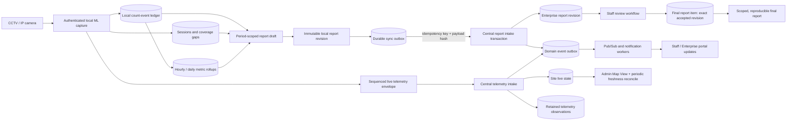
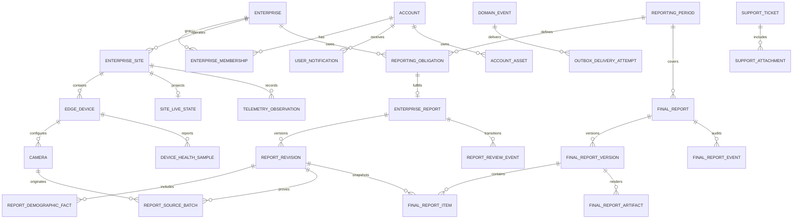
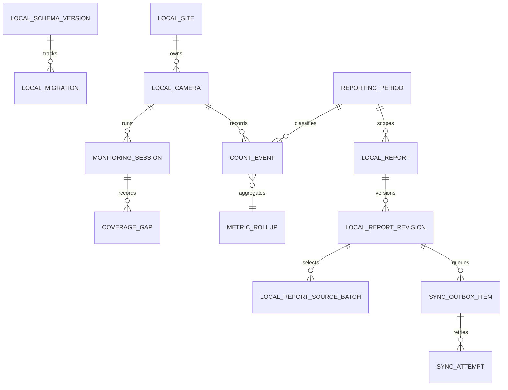

# TANAW Report Workflow and Data Architecture Implementation Plan

- **Plan status:** Ready for Codex delegation
- **Prepared from:** Comprehensive report-workflow, live-map, desktop/ML, frontend, and backend ERD review
- **Repository:** TANAW monorepo
- **Primary timezone:** `Asia/Manila`
- **Change strategy:** Rehearsed migration followed by one coordinated hard cutover and mandatory legacy removal

## 1. Purpose

This document turns the report-workflow review into an execution program that can be delegated to Codex in bounded, verifiable tasks. It covers the complete flow from CCTV capture through the enterprise desktop, local ledger, cloud synchronization, central PostgreSQL storage, Admin Map View, Staff review, final reports, notifications, and audit history.

The program is intentionally phased for development and rehearsal because TANAW currently has several integrity risks that interact with one another. Production, however, has one coordinated hard cutover: writes are stopped, an external backup is taken, data is migrated and verified, all applications switch to the new contracts, and every superseded table, column, view, route, component, store, flag, and fallback is removed before the upgraded system is accepted. Temporary coexistence is a migration mechanism only, never a production backup or a second source of truth.

### 1.1 Zero-legacy completion policy

- The final PostgreSQL schema contains only target tables and explicitly approved existing tables that remain part of the target architecture. A current table may remain only when this plan designates it as the correct long-term model and no replacement table supersedes it.
- Every superseded database object is dropped after its data has been transformed and verified. Historical records are preserved in the new schema; the old schema is not preserved around them.
- The final local SQLite schema contains no obsolete event, report, JSONL, migration-shadow, or sync structures.
- The final backend, frontend, desktop, and ML codebases contain no legacy readers, dual writers, route aliases, Zustand/data-source fallbacks, dormant compatibility branches, old DTOs, or deprecated components.
- Old desktop and portal builds are not supported against the cut-over backend. The deployment enforces a minimum compatible version and produces an explicit upgrade response.
- Safety comes from encrypted external database/file backups, repeatable migration tooling, restore rehearsals, and source control—not from retaining legacy tables or code in the live system.
- A legacy-object manifest must name every superseded table, column, index, view, API route, event type, source file/component, local store, feature flag, and background job. Program completion requires automated and manual proof that every manifest entry is absent.

## 2. Required outcomes

The implementation is complete only when all of the following are true:

1. A camera event belongs to one canonical reporting period at capture time and cannot be consumed by a submission for another period.
2. Retrying the same telemetry batch or report revision is idempotent and cannot duplicate a report, notification, audit event, final-report item, or WebSocket event.
3. Staff review operates on immutable report revisions. A final report references the exact accepted revision and remains reproducible after later enterprise resubmissions.
4. Official screens and exported PDFs never invent camera rows, audit actors, timestamps, demographics, coverage, or source proportions.
5. A final report has an explicit scope. A barangay or selected-enterprise subset cannot be labeled as a citywide report.
6. The Admin Map reflects freshness without requiring a new desktop message. Stale values become `Unknown`/`Unavailable`, and out-of-order telemetry cannot replace newer state.
7. Sync health represents the durable outbox and its oldest failure, not the number of events included in the telemetry message that is currently being acknowledged.
8. Local camera processing survives transient stream and SQLite failures, records monitoring gaps, and retains useful rollups without retaining raw identity data indefinitely.
9. The local ML API, WebSockets, and video stream accept only the Electron instance that launched the service.
10. The central ERD separates authentication, enterprise/site/device topology, live state, telemetry history, report identity, report revisions, review events, and final artifacts according to their different lifecycles.
11. Historical completeness is calculated from period-specific obligations, not from the current enterprise registry.
12. Simulation/mock data is visibly isolated from official data and cannot be consolidated accidentally.

## 3. Non-negotiable invariants

- Raw camera frames, facial imagery, ReID embeddings, and appearance metadata remain on the enterprise device. Central services receive only authorized aggregates, operational health, provenance, and report facts.
- Reporting windows use an inclusive start and exclusive end: `[period_start, period_end)`.
- UTC timestamps are stored for events; business dates and reporting periods are derived using the configured site timezone, initially `Asia/Manila`.
- Display labels such as “June 2026” are presentation values, never database identities or duplicate-detection keys.
- Accepted and consolidated report revisions are append-only. Corrections create another revision or an explicit workflow event.
- Server-derived identity, role, enterprise, `prepared_by`, and data classification override client claims.
- Unknown data stays unknown. It is not replaced with zero, “Stable,” a ratio, or a fabricated audit entry.
- Official and simulation data cannot share a final report.
- Every state transition is authorized, validated against the current state, durable, and auditable.
- All high-volume data has an explicit retention/downsampling policy before production rollout.

## 4. Current risks and target remedies

| Priority | Current risk                                                                                                   | Target remedy                                                                                                                           | Release proof                                                                        |
| -------- | -------------------------------------------------------------------------------------------------------------- | --------------------------------------------------------------------------------------------------------------------------------------- | ------------------------------------------------------------------------------------ |
| P0       | Events around month boundaries can be included in the wrong report and all open events can be marked submitted | Canonical `reporting_period_id`, capture-time business date, explicit source-batch membership, and atomic marking by event ID/watermark | Boundary tests at `23:59:59`/`00:00:00` and concurrent-event tests pass              |
| P0       | Pre-ack `unsyncedEvents` produces false “Sync Delayed” alerts that do not auto-resolve                         | Durable sync outbox state with pending count, oldest pending age, last failure, exact acknowledgements, and resolving alert rules       | A successful acknowledgement clears backlog health and resolves the derived alert    |
| P0       | Late failures and retries can duplicate report side effects or mutate already reviewed reports                 | Idempotency key + payload hash, one transaction for intake and domain outbox, immutable revisions, terminal-state guards                | Replaying the same request 100 times produces one revision and one logical event set |
| P0       | Final reports reread mutable intake data and do not have a foreign key to the exact source revision            | `final_report_items.report_revision_id` FK plus immutable final facts/artifact metadata                                                 | Generated output is byte/logically reproducible after a new enterprise revision      |
| P0       | Official review and PDFs fabricate cameras, timestamps, actors, demographics, and ratios                       | Remove fallback fabrication; return explicit missing/provenance fields and render “Not provided”                                        | Fixtures with absent fields show no invented content in UI/PDF                       |
| P0       | A filtered subset can be labeled “Citywide”                                                                    | Persist scope type and scope members; validate title and eligibility server-side                                                        | Partial selection yields a scoped report or is rejected as citywide                  |
| P0       | Local ML controls, WebSockets, and stream are unauthenticated                                                  | Per-launch capability, loopback-only binding, authenticated handshake/routes/streams, exact origin policy                               | Unauthenticated REST/WS/stream tests fail closed                                     |
| P1       | Map markers can remain green forever and stale occupancy is shown as live                                      | Materialized current state, monotonic device sequence, freshness evaluation, periodic reconciliation, stale-null semantics              | A stopped client becomes stale without sending another event                         |
| P1       | Analytics mutates memoized data, duplicates totals, and includes ineligible statuses                           | Pure transforms and server-defined inclusion semantics                                                                                  | Totals equal accepted facts across period/status filters                             |
| P1       | Query cache and WebSocket updates can leak/stale data across accounts or create partial lists                  | Account-scoped keys, cache reset on auth change, detail invalidation/refetch, list-safe patching                                        | Cross-account and reconnect tests pass                                               |
| P1       | Camera capture stops on transient failure; data gaps are not represented                                       | Reconnect state machine with bounded exponential backoff/jitter and coverage/gap records                                                | Stream interruption recovers and reports incomplete coverage                         |
| P1       | SQLite writes are duplicated/synchronous and local retention can destroy dashboard history                     | One transactional event ledger, serialized writer, WAL/busy timeout, retained hourly/daily rollups, full raw-data purge                 | Fault-injection and retention tests preserve aggregates and remove raw records       |
| P1       | Metric grain and meaning are ambiguous                                                                         | Explicit metric definition, window, site/camera scope, provenance, quality, coverage, and uniqueness semantics                          | API/UI labels match contract and mixed grains are rejected                           |
| P2       | `accounts`, telemetry, report intake, and operational service mix unrelated concerns                           | Add normalized topology/report/live-state tables; split feature services and routers                                                    | ERD and module boundaries match ownership/query patterns                             |
| P2       | Support attachments and profile images live as large JSON/base64 fields                                        | Attachment/asset metadata tables and object storage adapter                                                                             | Core rows remain bounded and retention/access controls are testable                  |
| P2       | In-process WebSocket fan-out is not multi-worker safe                                                          | Transactional domain outbox and broker/pub-sub adapter                                                                                  | Events are delivered consistently across two backend workers                         |

## 5. Target data flow



The report and live-telemetry paths share enterprise/site/device identity and the domain-event delivery mechanism, but not their persistence semantics. Reports are immutable business records; live state is a replace-if-newer projection; telemetry history is time-series evidence with retention.

## 6. Proposed central ERD

The names below are the recommended target. The schema owner may adjust naming in an approved architecture decision record (ADR), but must preserve the boundaries and invariants.



### 6.1 Table responsibilities

| Table                                    | Responsibility and key design points                                                                                                                                                                                            |
| ---------------------------------------- | ------------------------------------------------------------------------------------------------------------------------------------------------------------------------------------------------------------------------------- |
| `accounts`                               | Authentication principal only: email/login security, role-independent identity, status, lockout, activation, token invalidation, timestamps. Use native PostgreSQL UUIDs.                                                       |
| `enterprises`                            | Legal/operating enterprise identity, official code, category, lifecycle, and simulation classification where applicable.                                                                                                        |
| `enterprise_memberships`                 | Account-to-enterprise authorization and role; supports future multiple managers without duplicating enterprise fields in accounts.                                                                                              |
| `enterprise_sites`                       | Address, barangay, timezone, geocode coordinates/source/confidence, capacity, effective dates, and location versioning. Address edits invalidate or explicitly reconfirm coordinates.                                           |
| `edge_devices`                           | Install/gateway identity, capability/version, credential rotation metadata, last authenticated contact, counter epoch, and lifecycle. Do not persist a manually maintained gateway status here.                                 |
| `cameras`                                | Stable camera identity and site/device relationship. Central storage must not contain camera credentials or raw video.                                                                                                          |
| `site_live_state`                        | One current row per site, updated only by a newer `(counter_epoch, sequence, observed_at)` envelope. Stores freshness source timestamps and nullable live metrics.                                                              |
| `telemetry_observations`                 | Append-only, partitionable telemetry evidence with observed/received timestamps, metric definition/grain, source classification, and bounded payload.                                                                           |
| `device_health_samples`                  | Device/service/camera health and sync-outbox indicators; separate from enterprise visitor aggregates.                                                                                                                           |
| `reporting_periods`                      | Canonical ID, timezone, inclusive start, exclusive end, type, label, submission window, and status.                                                                                                                             |
| `reporting_obligations`                  | Which enterprise/site owed which report for a period, with eligibility/exemption/effective-registration facts frozen for historical completeness.                                                                               |
| `enterprise_reports`                     | One logical official report per obligation; current workflow state, current revision pointer, accepted revision pointer, and optimistic concurrency version.                                                                    |
| `report_revisions`                       | Immutable submitted facts: revision number, source window, metrics, provenance, quality, coverage, notes, submitted/received actors/times, idempotency key, and payload hash.                                                   |
| `report_demographic_facts`               | Zero or more facts with dimension, value, count/percentage, source, method, and quality. Missing rows mean missing data, not inferred ratios.                                                                                   |
| `report_source_batches`                  | Camera/site/source lineage, inclusive/exclusive event watermark or batch identity, event count, and aggregate checksum.                                                                                                         |
| `report_review_events`                   | Append-only transitions with server-authenticated actor, from/to state, reason, timestamp, and command idempotency key.                                                                                                         |
| `final_reports`                          | Logical final-report identity, reporting period, current workflow state, and optimistic concurrency version. It does not own mutable copies of source facts.                                                                    |
| `final_report_versions`                  | Immutable final snapshot/version with explicit scope type (`citywide`, `barangay`, `enterprise_selection`), scope definition, totals, server actor, finalized timestamp, and content hash. A correction produces a new version. |
| `final_report_items`                     | Child of one final-report version and FK to the exact accepted `report_revision_id`; optionally stores verified aggregate facts/hash for fast immutable rendering.                                                              |
| `final_report_events`                    | Append-only final-report lifecycle audit. No client-fabricated actors or timestamps.                                                                                                                                            |
| `final_report_artifacts`                 | Render version, content hash, storage key, MIME type, generated time/actor, and template version for reproducibility.                                                                                                           |
| `domain_events` / delivery attempts      | Transactional event record and asynchronous delivery bookkeeping for notifications, audit projection, cache invalidation, and broker fan-out.                                                                                   |
| `support_attachments` / `account_assets` | Metadata and object-storage keys; validate MIME/size/access. Remove base64 blobs from core JSON columns.                                                                                                                        |

### 6.2 Tables that should not be split merely because they are wide

- Keep `email_outbox` cohesive for now. Its fields represent one delivery lifecycle, and attempts already have a separate table. Split message bodies only if row size or retention evidence justifies it.
- Keep notifications and operational alerts as single core records, but add real foreign keys where the source is structurally known, constrained statuses/severities, deduplication keys, and lifecycle timestamps.
- Keep support-ticket core fields together; split only repeating/large attachments and message history.
- JSONB is acceptable for bounded, versioned, rarely queried extension data. It is not a substitute for relationships, status constraints, large media storage, or facts used in official reports.

### 6.3 Required constraints and indexes

- Use native PostgreSQL `uuid` for target primary/foreign keys. Transform legacy string UUIDs during migration and remove the legacy identifier columns unless an identifier is an actual business key.
- `UNIQUE (enterprise_id, reporting_period_id)` for an official logical report or, preferably, `UNIQUE (reporting_obligation_id)`.
- `UNIQUE (enterprise_report_id, revision_number)` and `UNIQUE (enterprise_report_id, idempotency_key)`; store and compare a canonical payload hash.
- Check all metric counts are non-negative; validate occupancy rules separately because exits and corrections may require domain-specific handling.
- Check source classification, workflow state, scope type, metric definition, quality, and provenance against server enums/check constraints.
- Enforce `period_start < period_end`, timezone presence, and non-overlapping periods of the same calendar/type where applicable.
- FK final items to final-report versions and report revisions, and prevent one revision from belonging to multiple active/finalized official final reports unless the business rule explicitly allows it.
- Use row locking or serializable/constraint-based protection for report revision numbers, final membership, and report-code allocation. Do not generate codes with an unprotected “select max + 1.”
- Latest-state lookup: `(site_id, observed_at DESC, sequence DESC)`; telemetry history: `(site_id, observed_at DESC)` and `(device_id, received_at DESC)`.
- Report work queues: `(reporting_period_id, workflow_state, received_at)`; obligations: `(reporting_period_id, status, enterprise_id)`.
- Notifications: `(recipient_account_id, read_at, created_at DESC)`; active alert partial indexes by status/severity/source.
- Partition high-volume telemetry by time and define retention/downsampling before cutover.

### 6.4 Existing-table disposition

The following decisions are based on the present SQLAlchemy model review. Column counts are useful warning signals, but lifecycle, cardinality, security, and query patterns—not width alone—determine whether a split is justified.

| Current table/model                                                   | Review finding                                                                                                                                   | Planned disposition                                                                                                                                                                  |
| --------------------------------------------------------------------- | ------------------------------------------------------------------------------------------------------------------------------------------------ | ------------------------------------------------------------------------------------------------------------------------------------------------------------------------------------ |
| `accounts` (about 37 columns)                                         | Mixes authentication, personal identity, enterprise profile, site address/geocode, gateway state, capacity, preferences, and simulation metadata | Keep authentication/account state in `accounts`; move enterprise identity, membership, sites/locations, devices, preferences/assets, and live gateway state to their owning tables   |
| `enterprise_telemetry_snapshots` (about 25 columns)                   | Combines aggregate visitor counts, one camera/device health record, sync health, payload JSON, and current/history behavior                      | Migrate required history/current state into `site_live_state`, `telemetry_observations`, and `device_health_samples`, then drop the old table and all adapters                       |
| `enterprise_report_submissions` (about 24 columns)                    | A mutable row is simultaneously logical report, submission revision, review state, demographic payload, sync state, and source payload           | Migrate into logical `enterprise_reports`, immutable `report_revisions`, facts/source batches, review events, and intake receipts, then drop the old table and payload path          |
| `final_reports` (about 16 columns) + `final_report_sources` (about 9) | Parent/child shape is directionally sound, but source IDs lack exact revision lineage and final data can be reread from mutable intake           | Keep a logical final parent, add immutable versions/items/events/artifacts, and enforce FKs to exact accepted report revisions                                                       |
| `email_outbox` (about 32 columns)                                     | Wide but cohesive around one delivery lifecycle; delivery attempts are already separate                                                          | Keep intact unless measured row-size/retention evidence later supports separating content; do not refactor it as part of reporting merely to reduce column count                     |
| `support_tickets` (about 15 columns)                                  | Core fields are cohesive; attachment JSON can carry multiple large base64 payloads                                                               | Keep ticket core; move repeating attachment metadata/content to `support_attachments` plus authorized object storage                                                                 |
| `user_notifications`, `operational_alerts`, and general activity logs | Reasonable core records but weak source/account referential integrity, string statuses, and incomplete durable workflow semantics                | Add constraints, deduplication/lifecycle fields, and real FKs where the relationship is structurally known; keep official report/final history in dedicated append-only event tables |
| System configuration/preferences JSON                                 | Flexible fields are carrying typed or large data that needs validation, querying, retention, or access control                                   | Keep only bounded versioned extensions in JSONB; move typed settings and media assets to explicit tables                                                                             |

The current operational backend is also a code-ownership hotspot: `operational/router.py` is roughly 1,260 lines and `operational/service.py` roughly 1,663 lines. The edge equivalents are similarly concentrated (`local_metrics_store.py` roughly 1,426 lines and `camera_manager.py` roughly 2,279 lines). Split these modules after contracts stabilize, along the domain boundaries in Wave 7, rather than performing a mechanical file split while behavior is still changing.

## 7. Proposed local SQLite ERD

The local database is an edge ledger, not a cache of a large JSON payload.



Required local behavior:

- `count_events` stores a stable event UUID, camera ID, captured UTC timestamp, business date, canonical period ID, direction/type, uniqueness/quality classification, payload schema version, and submission membership. One event is inserted once.
- A report revision selects exact event IDs or a safe per-camera watermark bounded by `[start, end)`. Mark only the selected records after the local revision is committed.
- Events captured after draft creation cannot enter that revision accidentally.
- The outbox stores command ID, idempotency key, endpoint/contract version, canonical payload/hash, creation time, next-attempt time, attempts, last error class, and acknowledgement. Deterministic 4xx errors become visible dead-letter items and do not block unrelated retryable items.
- `pending_count`, `oldest_pending_at`, and `last_failure_at/error_class` are derived from the outbox. They are the only backlog values sent as sync health.
- Enable WAL, a busy timeout, transactions, and a serialized/batched writer. A write failure must not terminate capture without a durable error/gap signal.
- Replace or reconcile duplicate JSONL persistence. Purge tooling must remove all raw event/identity copies while retained daily/hourly rollups continue to power the dashboard.
- Version SQLite migrations; create a backup/checkpoint before upgrades; test interrupted migration recovery. Do not silently recreate or discard a customer ledger.

## 8. Delivery strategy and hard-cutover model

Development may temporarily contain migration adapters so the transformation can be tested, but those adapters never become an accepted production end state. Use this sequence:

1. **Inventory:** Produce the target-schema inventory and legacy-object manifest. Classify every existing object as `retain_as_target`, `transform_then_drop`, or `drop_without_migration`, with an owner and proof query.
2. **Characterize:** Freeze required behavior and known defects in tests. Extract production-like data-shape statistics without sensitive payloads.
3. **Build target:** Implement the new schema, services, clients, and migration tools on a branch/test environment. Any temporary dual-read or comparison code is clearly marked and listed in the removal manifest.
4. **Rehearse:** Restore a representative external backup into an isolated environment, run the complete migration, compare normalized counts/hashes/lineage, validate constraints, run all application and end-to-end tests, drop legacy objects, and rerun the tests against the target-only schema.
5. **Prepare cutover:** Package the target-only backend, portal, desktop, and ML service; enforce minimum client versions; schedule a maintenance window; stop new report/telemetry writes; drain or explicitly migrate durable queues.
6. **Protect:** Take and verify encrypted external PostgreSQL and enterprise-local backups. Record restore commands, checksums, schema versions, migration build, and the exact source revision.
7. **Migrate:** Run idempotent, checkpointed transformations into target tables. Ambiguous records enter an explicit migration exception workflow and block official acceptance; they are never silently guessed.
8. **Verify:** Reconcile row counts, period totals, exact event/source membership, workflow history, final artifacts, accounts, locations, telemetry freshness, attachments, and outbox state. Validate all FKs/checks/uniqueness and run smoke/contract tests.
9. **Eradicate legacy:** Drop every `transform_then_drop`/`drop_without_migration` database object and deploy code with all old readers, writers, routes, components, flags, adapters, DTOs, and jobs physically removed. Run catalog and repository searches proving the legacy manifest is empty.
10. **Open:** Start only target-version services and compatible clients, run final smoke tests, and reopen writes. Completion is withheld if any superseded object or compatibility path remains.

There is no long-lived production dual-write period and no fallback to legacy tables inside the upgraded database. If cutover verification fails before acceptance, stop services, restore the complete external pre-cutover backup, and redeploy the matching pre-cutover application set. After successful acceptance, failures are fixed against the target architecture; legacy code or tables are not reintroduced.

## 9. Codex delegation protocol

### 9.1 Coordinator responsibilities

Use one lead Codex session as the coordinator. The coordinator owns the plan, schema decisions, integration, staging, commits, and final checks.

At the start of every task or wave, the coordinator must:

1. Read the root and nearest applicable `AGENTS.md` files.
2. Run `git status --short --branch` and `git diff --cached --stat`.
3. If a completed prior implementation is staged with a prepared commit message, commit it before starting unrelated work, as required by the repository instructions.
4. Confirm the dependencies, migration mode, and hard-cutover gates for the selected task.
5. Assign bounded tasks with non-overlapping ownership.
6. Reserve the Alembic revision chain and shared contract files for one owner at a time.

At the end of every task or wave, the coordinator must:

1. Review the complete diff and any user changes already present; never overwrite unrelated work.
2. Run targeted tests and every required lint/format/type gate for all affected projects.
3. Record migration, reconciliation, hard-cutover, and legacy-removal evidence in the task notes or ADR.
4. Stage only the completed task's files.
5. Prepare a conventional commit message; do not commit unless beginning the next unrelated implementation or explicitly requested.

### 9.2 Safe parallel lanes

| Lane                    | Owns                                                                                       | Must not edit concurrently with                                                           |
| ----------------------- | ------------------------------------------------------------------------------------------ | ----------------------------------------------------------------------------------------- |
| A — Central schema/API  | Alembic, SQLAlchemy models, report/telemetry services, API schemas, backend tests          | Another migration agent; any agent changing the same operational module or OpenAPI schema |
| B — Edge ledger/ML      | SQLite migrations/store, camera persistence/reconnect, local API auth, ML tests            | Another agent editing `local_metrics_store.py`, `camera_manager.py`, or `main.py`         |
| C — Desktop Electron/UI | Cloud sync/outbox client, Electron supervision/IPC, enterprise reporting UI, desktop tests | Lane B when changing a shared local API contract; coordinate contract first               |
| D — Portal              | Admin Map, Staff analytics/review/final UI, query cache/WebSockets, PDFs, frontend tests   | Lane A when changing response shapes; work from a frozen contract fixture                 |

With four concurrency slots, run at most one task per lane. The coordinator counts as a slot. Do not parallelize changes simply because files differ when both tasks alter the same persistence or API invariant.

### 9.3 Task prompt template

Use this template for every delegated Codex task:

```text
Objective:
Implement [task ID and outcome] from TANAW_REPORT_WORKFLOW_IMPLEMENTATION_PLAN.md.

Read first:
- Root AGENTS.md and any nearer AGENTS.md
- Plan sections [x]
- ADR/contract files [paths]

Dependencies already complete:
- [task IDs / migration revisions / cutover gates]

Allowed file ownership:
- [specific directories/files]

Do not change:
- [adjacent lanes, generated artifacts, unrelated user changes]

Required invariants:
- [copy the relevant invariants]

Deliverables:
- implementation
- migrations/backfill if assigned
- targeted unit/integration/contract tests
- migration, hard-cutover, external-restore, and legacy-removal notes

Acceptance scenarios:
- [Given/When/Then cases]

Verification:
- [targeted tests]
- [all affected-project AGENTS quality commands]

Return to coordinator:
- files changed
- behavior changed
- commands and results
- data migration, cutover, and legacy-removal concerns
- remaining risks

Do not stage or commit; the coordinator reviews and stages the integrated task.
```

## 10. Implementation waves and delegation cards

Tasks inside a wave may run in parallel only when the lane table allows it. Do not start a task until all listed dependencies are complete.

### Wave 0 — Containment, decisions, and characterization

#### W0-A: Freeze canonical contracts and metric semantics

- **Lane:** Coordinator + A
- **Dependencies:** None
- **Scope:** Add ADRs/contracts only; no behavior switch.
- **Deliverables:**
  - canonical reporting-period model and timezone/DST policy;
  - metric catalog defining entries, exits, occupancy, peak, venue-local unique estimate, confirmed/degraded quality, grain, window, coverage, and provenance;
  - report/final workflow state machines and authorization matrix;
  - final-report scope rules;
  - telemetry v2 and report-submission v2 request/response examples;
  - simulation-data isolation rules and minimum supported desktop contract version.
- **Acceptance:** No open definition remains for period identity, uniqueness semantics, missing data, accepted status, final scope, or retry acknowledgement.
- **Suggested commit:** `docs: define report and telemetry v2 contracts`

#### W0-B: Add end-to-end characterization tests

- **Lane:** A, B/C, and D may each own their project tests from the frozen fixtures.
- **Dependencies:** W0-A contract draft.
- **Scenarios to capture:**
  - June 30 `23:59:59.999` and July 1 `00:00:00` are separated;
  - an event arriving while a report is being submitted remains open for the proper revision/period;
  - duplicate and late-failed HTTP submissions do not duplicate logical effects in the target behavior;
  - an old/stale submission cannot reopen a returned, accepted, or consolidated report;
  - demographics/cameras/audit details absent from payload remain absent;
  - partial scope cannot be called citywide;
  - stopped telemetry becomes stale without another WebSocket event;
  - an older device sequence cannot overwrite current state;
  - logout/account switch exposes no previous account cache;
  - two concurrent finalizations cannot consume the same source revision;
  - local API controls and streams reject missing/invalid capabilities.
- **Acceptance:** Each defect has a named failing-before/passing-after test or a documented reason it requires an integration harness.
- **Suggested commits:** One test commit per affected project, e.g. `test: characterize report boundary and retry behavior`.

#### W0-C: Stop fabricated official output

- **Lane:** D, with a small C task for enterprise PDFs if needed.
- **Dependencies:** W0-A missing-data/provenance contract.
- **Scope:** `ReportReviewModal`, `FinalReportViewer`, DOT demographics utilities, PDF generators, and their tests.
- **Deliverables:** Remove fixed camera rows, impossible dates/times, hardcoded actors, fixed source splits, and generated demographic ratios. Add explicit `Not provided`, `Not captured`, or `Insufficient source data` presentation.
- **Acceptance:** Snapshot/content tests assert that missing inputs never produce a camera, demographic group, timestamp, actor, percentage, or method claim.
- **Rollout:** This is safe to release before schema v2; do not wait for the full migration.
- **Suggested commit:** `fix: remove fabricated official report content`

### Wave 1 — Additive schema foundations

#### W1-A: Split enterprise topology from accounts

- **Lane:** A; sole Alembic owner.
- **Dependencies:** W0-A.
- **Scope:** New `enterprises`, `enterprise_memberships`, `enterprise_sites`, `edge_devices`, and `cameras`; mappings from the 37-column account row; mandatory removal manifest for superseded account columns.
- **Deliverables:** Target schema/models, idempotent resumable transformation, consistency query/report, target-only service/repository path, indexes/FKs/checks, migration tests, and final drop operations for superseded columns.
- **Key rules:** Preserve account IDs and authentication. Store location with effective/version metadata. Invalidate/reconfirm coordinates when an address changes. Derive gateway/live status from live-state data, not an account column.
- **Acceptance:** Every real enterprise account maps to exactly one enterprise/site/membership; protected and LGU accounts do not acquire enterprise rows; all consumers use the new topology; superseded account columns/routes have zero references and are absent after cutover.
- **Recovery:** Before acceptance, restore the verified pre-cutover backup and matching application build if the transformation fails. Do not retain a live legacy read path.
- **Suggested commit:** `feat(backend): add normalized enterprise topology`

#### W1-B: Add periods, obligations, logical reports, and revisions

- **Lane:** A; sequential after W1-A in the same migration lane.
- **Dependencies:** W1-A and W0-A.
- **Scope:** Reporting tables described in Section 6; use `enterprise_report_submissions` only as migration input, then drop it during the hard cutover.
- **Deliverables:**
  - reporting periods and historical obligations;
  - logical enterprise reports and immutable revisions;
  - demographic facts, source batches, review events;
  - logical final reports, immutable final versions/items, exact revision FKs, scope metadata, final events/artifacts;
  - status/check constraints, optimistic version, uniqueness/concurrency protections;
  - legacy period parser with an ambiguity quarantine report.
- **Acceptance:** Migration reconciles counts and statuses for every unambiguous row; consolidated legacy rows resolve to a frozen revision; ambiguous period/source rows are reported and block acceptance; the old submission table, payload readers, writers, routes, and types are absent after cutover.
- **Recovery:** Restore the full pre-cutover database/application set before acceptance if reconciliation fails; do not ship both reporting models.
- **Suggested commit:** `feat(backend): add versioned reporting schema`

#### W1-C: Add live-state and time-series separation

- **Lane:** A; after the prior migration head is merged.
- **Dependencies:** W1-A and W0-A.
- **Scope:** `site_live_state`, `telemetry_observations`, `device_health_samples`, sequence/epoch fields, partitions/indexes/retention configuration.
- **Acceptance:** A conditional upsert changes current state only for a newer envelope; history accepts authorized evidence without making it current; current-state queries do not scan the snapshot table.
- **Suggested commit:** `feat(backend): add sequenced site live-state model`

#### W1-D: Add versioned local ledger and outbox schema

- **Lane:** B; parallel with central migrations after contracts freeze.
- **Dependencies:** W0-A.
- **Scope:** Local SQLite schema versioning, period/event/source-batch/outbox/attempt/session/gap/rollup tables.
- **Deliverables:** Transactional migration from the current local store, pre-migration external backup/checkpoint, integrity report, interrupted-upgrade recovery, WAL/busy-timeout configuration, and removal of old SQLite tables/columns/JSONL stores after verification.
- **Acceptance:** Existing local histories and report submissions survive in the target model; rerunning the migration is safe; a simulated interruption restores or resumes deterministically; a successful upgrade contains only the target ledger and cannot fall back to the old store.
- **Suggested commit:** `feat(ml): add versioned event ledger and sync outbox`

### Wave 2 — Correct edge capture, aggregation, and resilience

#### W2-A: Assign periods and business dates at capture

- **Lane:** B.
- **Dependencies:** W1-D and period contract from W0-A.
- **Scope:** Camera event creation and local metrics store queries.
- **Deliverables:** Period cache/lookup, capture-time UTC and local business date, exact half-open window selection, explicit period-aware summaries/history, and no fallback to the current month for unclassified events.
- **Acceptance:** Boundary, timezone, restart, late-processing, and report-during-capture tests pass. An unknown period blocks official submission with an actionable message instead of guessing.
- **Suggested commit:** `fix(ml): bind count events to canonical periods`

#### W2-B: Make local report revision creation atomic

- **Lane:** B; coordinate API shapes with C before implementation.
- **Dependencies:** W2-A.
- **Deliverables:** Create revision + source batch + selected event membership + outbox item in one transaction. Mark only selected events. Record metrics/provenance/quality/coverage and a canonical payload hash.
- **Acceptance:** New events inserted concurrently are not consumed; transaction failure leaves events open and no partial revision/outbox; re-creating the same command returns the same revision.
- **Suggested commit:** `feat(ml): create atomic period report revisions`

#### W2-C: Serialize persistence and retain trustworthy rollups

- **Lane:** B.
- **Dependencies:** W1-D; may run before W2-B if file ownership is serialized.
- **Deliverables:** One writer queue/transaction boundary, batching where safe, bounded retry on SQLite busy, poison-record diagnostics, hourly/daily rollups, and unified raw-data purge across SQLite/JSONL/snapshots/identity stores.
- **Acceptance:** Fault injection does not silently lose or double-count events; purging removes raw/identity records but leaves aggregate dashboard/report evidence according to policy.
- **Suggested commit:** `refactor(ml): unify event persistence and retention`

#### W2-D: Add camera reconnect and coverage accounting

- **Lane:** B.
- **Dependencies:** W1-D.
- **Deliverables:** Explicit connection state machine, bounded exponential backoff with jitter, recoverable/nonrecoverable error classification, monitoring sessions, coverage gaps, monitored minutes, and incomplete-coverage report warnings.
- **Acceptance:** A transient stream interruption reconnects without restarting TANAW; gap duration appears in the draft/report; permanent credential failure remains actionable and does not spin.
- **Suggested commit:** `feat(ml): recover camera streams and record coverage gaps`

### Wave 3 — Idempotent central intake and synchronization

#### W3-A: Implement report submission v2 transaction

- **Lane:** A.
- **Dependencies:** W1-B and W2-B contract fixture.
- **Deliverables:** Authenticated server-derived enterprise/actor/classification; idempotency key and payload-hash validation; one transaction for logical report, immutable revision, source facts, review event, and domain event; deterministic acknowledgement with revision ID/version.
- **Workflow rules:**
  - same key + same hash returns the original acknowledgement;
  - same key + different hash is a conflict;
  - new payload creates the next revision only from an allowed state;
  - accepted/consolidated revisions are not overwritten;
  - stale commands fail with current state/version;
  - mock/hybrid payloads cannot enter official intake.
- **Acceptance:** Retry/concurrency tests show exactly one revision and event set. No notification/audit/WebSocket side effect is committed outside the business transaction.
- **Suggested commit:** `feat(backend): add idempotent report v2 intake`

#### W3-B: Implement durable desktop outbox delivery

- **Lane:** C with B-owned local endpoints frozen first.
- **Dependencies:** W2-B and W3-A.
- **Deliverables:** Oldest-ready or fair queue ordering, exact acknowledgement, attempts with exponential backoff/jitter, deterministic-error dead letter, retryable-error continuation, payload-hash check, and visible recovery controls.
- **Key correction:** Never call a global “mark all events synced.” Acknowledge the exact outbox command/revision/source batch returned by the server.
- **Acceptance:** Network loss after server commit and before client receipt converges on one server revision; one dead-letter item does not block later independent items; app restart resumes safely.
- **Suggested commit:** `fix(desktop): make report sync durable and idempotent`

#### W3-C: Replace false sync-health semantics and alerts

- **Lane:** A and C as sequential contract/consumer tasks.
- **Dependencies:** W1-C, W3-B.
- **Deliverables:** Telemetry sends pending-outbox count, oldest pending age, last successful sync, last failure class/time; backend alert policy uses duration/threshold and auto-resolves when healthy; remove pre-ack event-count semantics.
- **Acceptance:** Sending a healthy batch cannot create “Sync Delayed”; actual backlog crossing the threshold creates one deduplicated alert; recovery records resolution and updates the map/alerts UI.
- **Suggested commits:** `feat(backend): derive alerts from durable sync health`, then `fix(desktop): publish acknowledged outbox health`.

#### W3-D: Introduce transactional domain-event delivery

- **Lane:** A.
- **Dependencies:** W3-A.
- **Deliverables:** Outbox worker, retry/dead-letter metrics, notification/audit projection handlers, broker/pub-sub adapter, idempotent consumers, and multi-worker WebSocket delivery strategy.
- **Acceptance:** Killing the process after DB commit but before publish still delivers once logically after restart; two workers do not create duplicate notifications; API success does not depend on an immediate WebSocket send.
- **Suggested commit:** `feat(backend): publish workflow events through an outbox`

### Wave 4 — Immutable Staff review and final reports

#### W4-A: Enforce report workflow state machine

- **Lane:** A.
- **Dependencies:** W1-B, W3-A, W3-D.
- **Deliverables:** Endpoint-specific RBAC, optimistic state/version command, server actor, immutable review event, allowed-transition table, reason requirements, and separate report/revision state where useful.
- **Acceptance:** Admin cannot perform Staff-only actions unless the approved policy explicitly grants it; two reviewers cannot both transition stale state; a stale enterprise revision cannot reopen accepted/consolidated work.
- **Suggested commit:** `feat(backend): enforce versioned report review transitions`

#### W4-B: Make finalization scoped, atomic, and reproducible

- **Lane:** A.
- **Dependencies:** W4-A.
- **Deliverables:** Server validates every requested source ID, accepted eligibility, same period, official classification, and scope. Lock selected revisions, allocate a collision-safe code, create the logical final plus immutable version/items/events/artifact metadata atomically, and bind the authenticated preparer.
- **Acceptance:** Missing source IDs are errors; concurrent finalizations cannot reuse active source revisions; a barangay subset is labeled barangay; finalized output remains unchanged after subsequent activity.
- **Suggested commit:** `feat(backend): finalize scoped reports from exact revisions`

#### W4-C: Switch Staff review, analytics, and final UI to v2

- **Lane:** D.
- **Dependencies:** W4-A/W4-B API stable.
- **Deliverables:**
  - use stable IDs and current detail queries rather than storing stale row objects;
  - display revision, provenance, coverage, quality, and explicit missing data;
  - keep Pending/Returned out of accepted tourism totals and compliance results;
  - make period transforms pure and prevent duplicate totals;
  - require/label explicit final scope;
  - generate PDF from the immutable final artifact/facts and real audit events only;
  - remove legacy Zustand report fallback.
- **Acceptance:** UI totals match server fixtures; remote report/final events invalidate both list and detail/intake queries; no official claim exists only in frontend code.
- **Suggested commit:** `feat(frontend): adopt immutable scoped report workflow`

#### W4-D: Fix reporting obligations and notifications

- **Lane:** A then D/C consumers.
- **Dependencies:** W1-B and W3-D.
- **Deliverables:** Period-specific expected enterprise set, eligibility/exemption reasons, pre-window/current-period obligations, overdue reminders for the selected period, and idempotent notification keys.
- **Acceptance:** Registering an enterprise today does not make a historical period incomplete; notifications exist before a submission and link to the intended period; follow-up actions honor the selected period.
- **Suggested commit:** `feat: derive reporting compliance from period obligations`

### Wave 5 — Truly live and trustworthy Admin Map

#### W5-A: Implement sequenced telemetry v2 intake

- **Lane:** A.
- **Dependencies:** W1-C and topology from W1-A.
- **Deliverables:** Authenticate device/account ownership; server-controlled source classification; validate metric grain/window; store observation/device health; conditionally update live state by counter epoch + sequence + observed time; expose current state separately from history.
- **Acceptance:** Reordered/replayed messages cannot roll state backward; a device restart with a new epoch is handled; one camera health sample is never presented as enterprise-wide aggregate health.
- **Suggested commit:** `feat(backend): ingest sequenced telemetry envelopes`

#### W5-B: Add freshness transitions and retention

- **Lane:** A.
- **Dependencies:** W5-A.
- **Deliverables:** Fresh/stale/offline thresholds, scheduled or query-time freshness projection, stale metrics set to null/unknown, telemetry partition/retention/downsampling job, and observability for ingestion lag.
- **Acceptance:** Freshness changes as wall time passes even with no new message; occupancy is not retained as “live” past TTL; history queries use bounded indexed/partitioned paths.
- **Suggested commit:** `feat(backend): expire stale live state and retain telemetry`

#### W5-C: Reconcile Admin Map and registry views

- **Lane:** D.
- **Dependencies:** W5-B API stable.
- **Deliverables:** Periodic refetch/reconcile in addition to WebSockets; account-scoped query keys; cache clear on auth boundary; safe list patching that never creates a one-item authoritative list from no cache; null/stale presentation; map and registry consume the same site/live-state identity; address/coordinate mismatch warnings.
- **Acceptance:** Closing a desktop turns its marker stale/offline without another event; login as another account reveals no previous data; a first WebSocket message triggers a refetch rather than fabricating a complete list; no trend defaults to “Stable” without evidence.
- **Suggested commit:** `fix(frontend): reconcile sequenced Admin Map state`

#### W5-D: Correct activity and notification realtime behavior

- **Lane:** D, working from W3-D events.
- **Dependencies:** W3-D.
- **Deliverables:** One shared realtime subscription per event stream, targeted query invalidation, final events invalidating intake/list/detail, and consistent optimistic read/unread rollback semantics.
- **Acceptance:** Multiple screens do not multiply sockets; remote changes converge after reconnect; failed mark-read restores the cache.
- **Suggested commit:** `fix(frontend): centralize realtime cache reconciliation`

### Wave 6 — Local service security and desktop trust boundary

#### W6-A: Authenticate the Electron-to-ML channel

- **Lane:** B and C must implement against a frozen handshake contract, sequential where files overlap.
- **Dependencies:** W0-A local security decision; can start after Wave 1 independently of report work.
- **Deliverables:**
  - cryptographically random per-launch capability passed out of command-line/process listings where possible;
  - loopback-only bind on a coordinator-selected or ephemeral port;
  - authenticated health handshake proving TANAW service/version/launch identity;
  - authorization on every control/data endpoint, WebSocket, and stream;
  - exact CORS/origin policy or no browser CORS where IPC is used;
  - Electron child-process/PID ownership checks and controlled renderer IPC;
  - capability rotation on restart and no secret logging.
- **Acceptance:** An unrelated process on port 8765 is rejected; missing/wrong/stale capability gets no data/control/stream; valid Electron reconnect works; automated logs contain no capability or camera credential.
- **Suggested commits:** `feat(ml): require a per-launch local capability`, then `feat(desktop): verify and authenticate the ML child service`.

#### W6-B: Harden camera credential and stream access

- **Lane:** C/B.
- **Dependencies:** W6-A.
- **Deliverables:** Keep credentials in the main process/secure store, expose only narrowly scoped IPC, prohibit credentials/tokens in URLs or renderer logs, and apply CSP/stream authorization.
- **Acceptance:** Renderer devtools/network history and application logs do not expose RTSP credentials or local capability; stream access is revoked when the session ends.
- **Suggested commit:** `security(desktop): isolate camera and ML credentials`

### Wave 7 — Modularization, scale, and bounded storage

#### W7-A: Split the backend operational feature by domain

- **Lane:** A; do this after v2 contracts stabilize to avoid conflict-heavy churn.
- **Dependencies:** Waves 3–5 backend complete.
- **Target modules:** `telemetry`, `reporting`, `final_reports`, `alerts`, `notifications`, `support`, `simulation`, and shared event/outbox infrastructure.
- **Deliverables:** Small routers/services/repositories with explicit transaction ownership; generated or shared schema contract workflow; eliminate N+1 final-report reads and replace 500-row caps with cursor/page metadata.
- **Acceptance:** Public API behavior stays covered by contract tests; no cross-domain service commits a caller-owned transaction; list endpoints paginate deterministically.
- **Suggested commit:** `refactor(backend): split operational domains and paginate queries`

#### W7-B: Move large binary/base64 content out of core rows

- **Lane:** A plus C/D consumers.
- **Dependencies:** W1-A topology and an approved object-storage adapter.
- **Deliverables:** Support-attachment/account-asset child metadata, signed/authorized upload/download flow, MIME/size/hash validation, retention/deletion, complete transformation from legacy JSON, consumer cutover, and removal of the old blob fields/readers.
- **Acceptance:** Core account/ticket reads no longer load multi-megabyte base64 payloads; access is authorized; orphan cleanup and deletion are tested.
- **Suggested commit:** `feat: store support and profile assets outside core rows`

#### W7-C: Add durable workflow audit and retention policy

- **Lane:** A.
- **Dependencies:** W3-D, W4-A/W4-B.
- **Deliverables:** Preserve report/final transition history independent of general activity-log retention; document retention for telemetry, raw local data, rollups, domain events, notifications, alerts, and artifacts.
- **Acceptance:** Purging the general activity log does not make an official report unauditable.
- **Suggested commit:** `feat(backend): preserve durable report workflow history`

### Wave 8 — Rehearsed hard cutover and zero-legacy acceptance

#### W8-A: Rehearse the entire transformation offline

- **Owner:** Coordinator.
- **Dependencies:** All target write/read paths and migration/removal operations complete.
- **Deliverables:** Restore a production-like external backup; run the migration from current to target; compare period/enterprise totals, exact lineage, workflow/final hashes, accounts, locations, telemetry, queues, and assets; enforce constraints; drop every manifest object; and run the full test/E2E suite against the target-only result.
- **Exit thresholds:** Zero silent period misclassification; zero duplicate logical effects; zero unexplained reconciliation deltas; zero invalid final-source references; zero superseded catalog/repository objects; successful full restore drill; cutover duration within the approved maintenance window.

#### W8-B: Enforce one compatible application generation

- **Lane:** Coordinator + A/B/C/D.
- **Dependencies:** W8-A passed.
- **Deliverables:** Target-only backend/portal/desktop/ML builds, minimum desktop/API contract enforcement, graceful mandatory-upgrade message, final migration hashes, signed release inventory, and removal of development-only comparison/dual-path flags from the production build.
- **Acceptance:** An outdated client cannot read or write against the target system; all supported clients use canonical period, telemetry, report, and final-report contracts; no compatibility route is registered.

#### W8-C: Execute the coordinated production cutover

- **Owner:** Coordinator; only one migration operator.
- **Dependencies:** W8-A/W8-B, approved maintenance window, external backup destination, and restore operator available.
- **Deliverables:** Enter maintenance mode; stop/drain writes; take and verify external backups; migrate and reconcile; deploy the target application generation; validate constraints; remove all manifest objects; run catalog/repository/API-route/local-store proof checks and smoke tests; then reopen the system.
- **Failure rule:** Before acceptance, any failed invariant stops the cutover and triggers full database/file restore plus redeployment of the matching pre-cutover application set. Never recover by selectively reading retained old tables.
- **Suggested commit:** `refactor: complete target architecture and remove legacy system`

#### W8-D: Prove zero-legacy completion

- **Owner:** Coordinator plus independent reviewer.
- **Dependencies:** W8-C migration finished; system remains closed until proof passes.
- **Required absence:** Old report payload/string-period logic, `enterprise_report_submissions`, superseded telemetry snapshots, obsolete account enterprise/location/gateway columns, mutable final-source storage, stale Zustand report store, duplicated JSONL persistence, fabricated fallback utilities, old summary scans, base64 asset fields, v1 routes/DTOs/events, dual writers/readers, compatibility flags, and old SQLite structures.
- **Proof:** PostgreSQL/SQLite catalog queries, OpenAPI route/schema diff, repository `rg` searches, package/build inspection, generated artifact inspection, and an end-to-end workflow executed with legacy objects physically unavailable.
- **Acceptance:** The signed legacy manifest has no unresolved entry. Documentation, mock tooling, tests, deployment files, and support runbooks describe only the target architecture.

## 11. Cross-project API and state conventions

### 11.1 Command envelope

All retryable writes should use a consistent envelope:

```json
{
  "contractVersion": 2,
  "commandId": "uuid",
  "idempotencyKey": "stable-client-generated-key",
  "occurredAt": "UTC timestamp",
  "expectedVersion": 3,
  "payload": {}
}
```

The server calculates a canonical payload hash and returns the durable resource ID/version plus whether the command was created or replayed. It must not trust client account/role/preparer/source classification fields.

### 11.2 Metric envelope

Every metric used outside the edge must identify:

- metric name and definition version;
- value and unit;
- aggregation grain (`camera`, `site`, `enterprise`);
- window start/end and timezone/business date;
- source batch/camera/device where permitted;
- provenance (`camera-derived`, `operator-entered`, `system-derived`);
- quality (`confirmed`, `degraded`, `estimated`, `unknown`);
- coverage/monitored duration and gaps;
- source classification (`official` or isolated simulation).

Do not describe summed venue-local unique estimates as distinct citywide people. If the final report sums them, label the measure precisely and disclose its method.

### 11.3 Query and realtime rules

- Query keys always include authenticated account/role and meaningful filters.
- Clear or replace all protected caches during logout/account change.
- WebSocket/domain events carry resource IDs and versions; clients invalidate/refetch authoritative data unless a safe, complete patch is available.
- Never initialize an absent list cache with one received item and treat it as the complete collection.
- Store modal selection by stable ID; query current detail so remote workflow changes are visible.
- REST and WebSocket authorization use the same endpoint-specific policy definitions.

## 12. Test and verification matrix

### 12.1 Required targeted suites

| Area               | Minimum automated coverage                                                                                                            |
| ------------------ | ------------------------------------------------------------------------------------------------------------------------------------- |
| Reporting periods  | Half-open boundaries, timezone conversion, late processing, missing period, obligation eligibility/effective dates                    |
| Local ledger       | Migration/restart, exact event membership, concurrent insert/submit, transaction rollback, WAL contention, purge/rollup retention     |
| Sync/outbox        | Ack loss, duplicate replay, hash conflict, backoff, dead letter isolation, restart recovery, exact event acknowledgement              |
| Backend intake     | Transaction rollback, server actor/classification, immutable revision, stale version, state transition/RBAC, one logical domain event |
| Finalization       | Missing/ineligible/mixed-period/mixed-source inputs, scope labeling, concurrent finalization, reproducibility, collision-safe code    |
| Telemetry/map      | Out-of-order/replayed sequence, new epoch, freshness expiry, null stale values, address/geocode drift, partition query                |
| Frontend           | Pure totals, accepted-status inclusion, account cache isolation, list/detail invalidation, missing-data rendering, scoped PDF         |
| Local security     | REST/WS/stream unauthorized, wrong/stale capability, rogue process/port, no-secret logging, Electron restart                          |
| Camera reliability | Recoverable disconnect, credential failure, backoff bounds, gap duration, database fault, graceful shutdown                           |
| Retention/audit    | Raw data removed, rollups retained, official workflow audit retained, domain-event cleanup safety                                     |

### 12.2 Repository quality gates

Run all commands for every affected project before staging a completed implementation.

Backend, from `backend-tanaw`:

```bash
UV_CACHE_DIR=/tmp/uv-cache uv run pytest -q
UV_CACHE_DIR=/tmp/uv-cache uv run ruff check .
UV_CACHE_DIR=/tmp/uv-cache uv run ruff format --check .
UV_CACHE_DIR=/tmp/uv-cache uv run mypy .
UV_CACHE_DIR=/tmp/uv-cache uv run pyright
```

Desktop ML service, from `desktop-tanaw/ml-service`:

```bash
UV_CACHE_DIR=/tmp/uv-cache uv run python -m unittest discover -s tests
UV_CACHE_DIR=/tmp/uv-cache uv run ruff check .
UV_CACHE_DIR=/tmp/uv-cache uv run ruff format --check .
UV_CACHE_DIR=/tmp/uv-cache uv run mypy .
UV_CACHE_DIR=/tmp/uv-cache uv run pyright
```

Frontend, from `frontend-tanaw`:

```bash
npm run test
npm run lint
npm run type
npm run build
```

Run relevant Playwright scenarios with `npm run test:e2e` when a user workflow, authentication boundary, WebSocket reconciliation, Admin Map, or report/PDF interaction changes.

Desktop, from `desktop-tanaw`:

```bash
npm run test
npm run lint
npm run type
npm run build
```

Run relevant Electron Playwright scenarios with `npm run test:e2e` for local service supervision, authentication, report retry/restart, and camera UI workflows.

For migration-bearing changes, also rehearse:

- upgrade from a representative production-like snapshot to Alembic head;
- rerun/resume of the backfill;
- target-only application startup after all old tables, columns, views, routes, flags, and local stores have been removed;
- rejection of outdated desktop/API clients with a clear mandatory-upgrade response;
- constraint validation after backfill;
- complete external backup restore with the matching pre-cutover application build;
- catalog and repository proof that the signed legacy manifest is empty.

If any command cannot run because of an environment problem, record the exact command, exit output, and reason. Do not replace a required check with an assumption.

## 13. Observability and release gates

Add operational metrics/logs without event payloads or credentials:

- period-classification failures and quarantined legacy rows;
- report command replay/hash-conflict counts;
- local and central outbox pending count, oldest age, retry/dead-letter counts;
- report revision and state-transition conflicts;
- finalization conflicts, scope types, and artifact hash failures;
- telemetry observed-to-received lag, sequence replays/out-of-order drops, stale/offline sites;
- live-state shadow mismatches and old/new report aggregate mismatches;
- domain-event publish lag and consumer deduplication counts;
- camera reconnect attempts, downtime, coverage percentage, SQLite writer lag/errors;
- target-client deployment and outdated-client rejection counts.

Do not accept the rehearsal or reopen production when:

- a report is assigned to a wrong period;
- a retry creates duplicate business effects;
- old/new accepted totals differ without a reviewed explanation;
- a final report cannot be reconstructed from exact immutable sources;
- stale live data is shown as current;
- unauthorized local or central access succeeds;
- an unresolved dead-letter can hide a required official submission.

## 14. Rollback and recovery

- Before cutover acceptance, rollback means stopping all services, restoring the complete verified external database/local-data backups, and redeploying the exact matching pre-cutover application generation.
- Do not keep old tables, columns, views, endpoints, readers, writers, or feature-flag branches in the upgraded system as an in-place rollback mechanism.
- Do not mix a restored old application with a partially migrated database or a new application with a restored old database.
- Backfills are resumable and idempotent, with per-batch checkpoints and quarantined exceptions.
- Before local SQLite migration, checkpoint/backup the database and document recovery in the desktop UI/support flow.
- Before central migration and legacy removal, take and test a restore from a production-like external backup.
- Domain-event consumers are idempotent, so replay is the recovery mechanism.
- A failed final artifact generation does not discard the finalized database record; it creates a retryable artifact job with visible state, unless policy requires finalization and rendering to be a single guarded operation.
- After the target cutover is accepted and the system is reopened, incidents are fixed forward on the target architecture or recovered from target-schema backups. Superseded objects are never reintroduced.
- Security recovery must never re-enable unauthenticated local routes. Disable the affected capability-dependent feature if a safe fix is not yet available.

## 15. Definition of Done

A task is not done because its happy path works. It is done when:

- its acceptance scenarios and failure/retry/concurrency tests pass;
- all affected project quality gates pass;
- its transformation is rehearsed, resumable, reconciled, and has a complete external restore plan;
- privacy and authorization invariants are tested;
- API/schema documentation and mock-data tooling are updated;
- new status/metric semantics are visible and accurately labeled in the UI;
- no unused imports, variables, dead code, debugging artifacts, or obsolete fallback remain in the task scope;
- telemetry/retention/alerting exists for the new failure modes;
- the coordinator reviewed the diff, staged only relevant files, and prepared the commit message;
- every superseded object introduced or encountered by the task is recorded in the legacy manifest and removed by the hard-cutover gate.

The full program is done only after the target contract is the sole read/write path, final reports are reproducible from immutable revisions, the Admin Map ages correctly, local control surfaces are authenticated, historical compliance is obligation-based, all target-only tests pass, and the signed legacy manifest proves that every superseded database and code object has been physically removed. Legacy removal is part of implementation completion, not a future cleanup release.

## 16. Recommended first Codex execution sequence

Start with these tasks, in this order:

1. W0-A: approve period, metric, workflow, scope, v2 contract, and security decisions.
2. W0-B and W0-C in parallel: capture regressions and remove fabricated official output.
3. W1-D in the edge lane while W1-A then W1-B run in the sole central migration lane.
4. W2-A/W2-B and W3-A: establish correct period membership and idempotent revision intake.
5. W3-B/W3-C/W3-D: make delivery and side effects convergent.
6. W4-A/W4-B/W4-C: switch Staff workflow and finalization to exact immutable revisions.
7. W1-C/W5-A/W5-B/W5-C: switch Admin Map to sequenced live state.
8. Run W6-A/W6-B as an independent security lane as soon as its contract is approved; do not postpone it to final cleanup.
9. Complete W2-C/W2-D, W4-D, W5-D, and Wave 7 hardening.
10. Rehearse the complete current-to-target transformation, including legacy deletion and external restore.
11. Perform the coordinated Wave 8 hard cutover; do not reopen TANAW until target-only smoke tests and the zero-legacy manifest pass.

The coordinator should open a tracking issue/checklist for every delegation card and link its ADR, migration revision, tests, cutover gate, dashboard, legacy-manifest entries, and prepared commit. This keeps the major implementation reviewable and prevents one long-lived branch from becoming another hidden source of inconsistency.
