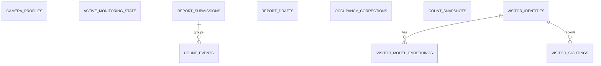

# TANAW Enterprise Desktop

Cloud-backed tickets and notifications use the shared authenticated `/realtime/ws` provider. Camera and local ML-service transports remain independent. See [the realtime architecture](../docs/REALTIME_ARCHITECTURE.md).

Electron, React, TypeScript, Vite, and local FastAPI ML service for
enterprise-side camera monitoring, local counting, local report drafting, cloud
sync, and offline-friendly operational workflows.

## Full Setup After Cloning

The backend, web portal, and PostgreSQL should be started with the root Docker
Compose stack. The desktop app itself runs locally on the host because it needs
native Electron behavior, local storage, ML model files, and camera/network
access.

The desktop app requires Node.js 22.12 or newer, npm, Python 3.12 or newer for
the local ML service, and `uv`. Camera AI requires detector model assets under
`ml-service/models/`.

The desktop renderer runs on port `5174` in development. The local ML service
runs on `127.0.0.1:8765` by default and is started by Electron when needed.

### Linux

From the TANAW repository root:

```bash
test -f .env || cp .env.example .env
docker compose up --build -d
cd desktop-tanaw
npm ci
uv sync --directory ml-service --frozen
npm run models:setup
npm run models:setup:reid
printf 'VITE_API_BASE_URL=http://localhost:8000\n' > .env.local
npm run dev
```

If `.env` already exists, do not overwrite it. The desktop `.env.local` points
the local Electron renderer at the Dockerized backend.

### Windows PowerShell

From the TANAW repository root:

```powershell
if (-not (Test-Path .env)) { Copy-Item .env.example .env }
docker compose up --build -d
Set-Location desktop-tanaw
npm ci
uv sync --directory ml-service --frozen
npm run models:setup
npm run models:setup:reid
Set-Content -Path .env.local -Value "VITE_API_BASE_URL=http://localhost:8000"
npm run dev
```

If `.env` already exists, do not overwrite it. The desktop `.env.local` points
the local Electron renderer at the Dockerized backend.

### Expected Local Services

- Dockerized web portal: `http://localhost:5173`
- Dockerized backend API: `http://localhost:8000`
- Desktop renderer: `http://127.0.0.1:5174`
- Local ML service: `http://127.0.0.1:8765`

Electron starts the ML service automatically from `ml-service/main.py`. If
another service is already listening on the ML port, the desktop attempts to
connect to it and reports conflicts in the camera panel.

In development, Electron launches the service through `uv run --frozen` so an
existing `.venv` is synchronized with `ml-service/uv.lock` before Python
starts. Packaged builds still prefer a prepared runtime under the packaged ML
service directory when one is present, with the locked `uv` environment as the
existing fallback.

Override the ML port only when needed:

Linux:

```bash
TANAW_ML_SERVICE_PORT=8770 npm run dev
```

PowerShell:

```powershell
$env:TANAW_ML_SERVICE_PORT = "8770"
npm run dev
Remove-Item Env:TANAW_ML_SERVICE_PORT
```

The ML service allows two concurrent camera pipelines by default. Enterprise
devices with validated additional capacity can set `TANAW_MAX_CONCURRENT_CAMERAS`
to a whole number from 1 through 16 before launching Electron. Requests above
the configured limit are rejected without stopping an existing camera.

### Docker Boundary

The desktop app is not containerized for normal development or production use.
Dockerizing the Electron runtime would make camera access, native app storage,
tray behavior, installer packaging, and Windows permissions harder for end
users. Use Docker for the central backend/frontend/database stack, and run the
desktop locally.

Containerizing desktop internals can still be useful for CI or isolated
ML-service checks, but it is not the supported way to run the enterprise app.

## Development Commands

Linux and PowerShell use the same commands from `desktop-tanaw`:

```bash
npm run dev
npm run build
npm run dist
npm run lint
npm run type
npm run preview:web
```

`npm run dev` starts the Vite/Electron development flow. `npm run dist` builds
the renderer and packages the Electron app.

## Detector Model Setup

Detector binaries are intentionally not committed to Git. Keep local assets under:

```text
ml-service/models/
```

Default setup:

```bash
npm run models:setup
```

This prepares:

- `models/yolo11n.pt` for emergency and compatibility fallback profiles
- `models/yolo11s.pt` for the default balanced profile
- `models/yolo11m.pt` for the high-accuracy profile

To download a smaller local subset for constrained testing, pass explicit model names:

```bash
npm run models:setup -- --models yolo11n yolo11s
```

Generate CPU/Intel OpenVINO exports:

```bash
npm run models:setup:openvino
```

Expected OpenVINO export folders:

```text
models/yolo11n_480_openvino_model/
models/yolo11n_640_openvino_model/
models/yolo11s_640_openvino_model/
models/yolo11m_640_openvino_model/
```

PowerShell uses the same npm scripts.

## ReID Model Setup

The live `fast` and `quality` ReID modes use distinct, pinned OSNet ONNX assets.
Export both before ReID testing:

```bash
npm run models:setup:reid
```

This prepares:

- `models/person_reid_cpu.onnx`: OSNet x0.25 for low-latency track association
- `models/person_reid.onnx`: OSNet-AIN x1.0 for higher-quality visitor confirmation

Verify a proposed stress-test stack before recording results:

```bash
npm run models:verify -- --profile balanced --reid fast
```

The live app still degrades safely when an asset is unavailable. The replay
tool intentionally refuses to run a requested ReID variant with missing assets,
because silently substituting a model would invalidate the comparison.

## ML Processing Profiles

- `auto`: selects the best available stable profile for the device.
- `emergency`: YOLO11n at 480px, ByteTrack, OpenVINO -> CPU -> CUDA, ReID off.
- `compatibility`: YOLO11n at 640px, ByteTrack, CUDA -> OpenVINO -> CPU, ReID off by default.
- `balanced`: YOLO11s at 640px, BoT-SORT, CUDA -> OpenVINO -> CPU, fast ReID.
- `high_accuracy`: YOLO11m at 640px, BoT-SORT, CUDA -> OpenVINO -> CPU, fast ReID.

Stable detector runtimes are `cpu`, `cuda`, and `openvino`. TensorRT and DirectML provider detection may appear in diagnostics, but they are not stable detector runtime choices.

## Counting, Tripwires, And Unique Visitors

Normal users should configure only the camera stream, start/stop processing, and adjust the entry/exit tripwires. Advanced AI tuning is kept behind the advanced settings area.

Counting uses:

- tracking confidence to keep person tracks alive;
- stricter counting confidence before a track can be counted;
- full-frame ROI by default;
- entry and exit tripwire sequence;
- cooldowns to avoid duplicate counts;
- optional ReID for estimated daily unique visitors.

Unique visitor fields are estimates:

- `estimated_unique_count`: confirmed and degraded daily unique estimate used by the UI.
- `confirmed_unique_count`: high-confidence entries linked to a confirmed ReID identity.
- `degraded_unique_count`: entries counted as unique when ReID is off, unavailable, or timed out.
- `pending_unique_entries`: ambiguous ReID identities excluded from the estimate until later evidence confirms or reconciles them.
- `repeat_entry_count`: entry events linked to an existing visitor or otherwise not unique.

Confirmed identities retain multiple appearance prototypes. When clothing or
another appearance change creates an ambiguous identity, TANAW keeps it
provisional. A later strong sighting either merges it into a confirmed identity
or promotes it as a genuinely new visitor. This reduces immediate overcounting
without silently rewriting submitted reports.

## Local Data And Ledgers

TANAW Enterprise Desktop stores structured enterprise data in one
enterprise-scoped `tanaw_desktop.sqlite3` database. This includes camera
profiles, active monitoring state, count events and snapshots, occupancy
corrections, report drafts and submissions, and visitor identity metadata.

Authentication tokens and camera credentials are intentionally excluded from
SQLite. Electron protects those values with the operating system's secure
storage. Theme, notification-read state, and other non-authoritative UI
preferences remain in Chromium storage. Live camera frames remain in memory and
are never stored as database rows.

TANAW accepts RTSP cameras only. Camera creation requires both a non-blank
device username and device password. These are device credentials and do not use TANAW account
password-complexity rules. Stream URLs remain credential-free. Existing
passwords are never populated into the edit form; a blank edit password keeps
the encrypted value unchanged, while an entered value replaces it. Electron
refuses plaintext credential persistence when OS secure storage is unavailable,
returns only username/configured metadata to the renderer, and injects the
stored secret into local camera test/start requests inside the main process.
Renderer-only development falls back to memory rather than local or session
storage.

Enterprise Support Tickets provide Recommended, Newest first, Oldest first,
Priority: Urgent to Low, Priority: Low to Urgent, Status, and Recently updated
sorting. Recommended follows the central unresolved priority order and keeps
resolved requests last. The selected sort and the serializable, non-sensitive
ticket draft are user/route scoped for the authenticated session; photo drafts
remain memory-only. Passwords and camera credentials are excluded. Logout
clears the scoped page and draft state.

Ticket and report-ledger cells measure rendered overflow with `ResizeObserver`.
The keyboard-accessible horizontal ellipsis appears only when the current
column width, wrapping, and font metrics actually clip content; expansion does
not rely on a character threshold.

RTSP camera IPs are canonicalized before persistence and must be
unique within the current enterprise camera list. Adding or editing a duplicate
keeps the form and credentials intact, focuses the IP field, and shows an inline
conflict. The serialized local configuration write boundary repeats the same
validation so concurrent renderer actions cannot persist a duplicate. Separate
enterprise lists may reuse the same private IP, and legacy duplicates are
reported without automatic deletion or merging.

The canonical local relationships are:



Camera IDs and names on events, snapshots, corrections, identities, and active
state are intentional historical snapshots. They remain usable after a camera
profile is deleted and therefore are not foreign keys to `camera_profiles`.
`report_drafts.report_id` can identify either a local or already-synchronized
cloud report, so it is also intentionally unconstrained.

Commands below run from `desktop-tanaw`. Close the desktop application before running any clear command.

### Inspect Local Data

Inspect every local ledger:

```bash
npm run local-data -- inspect
```

Inspect one enterprise:

```bash
npm run local-data -- inspect --enterprise "archies_001@tanaw.sanpedro"
```

Show more recent events and reports:

```bash
npm run local-data -- inspect --enterprise "archies_001@tanaw.sanpedro" --limit 25
```

Produce JSON:

```bash
npm run local-data -- inspect --json
```

PowerShell uses the same commands.

Inspection output includes:

- Electron app-data and SQLite ledger paths;
- schema version and row counts for camera profiles, active state, events,
  snapshots, report drafts, submitted reports, visitor identity tables, and
  occupancy corrections;
- current unsubmitted draft event count;
- first and last event timestamps;
- recent events and reports;
- Chromium local-storage size and location.

Sensitive embedding blobs and full event payloads are not printed.

### Clear One Enterprise Ledger

```bash
npm run local-data -- clear --enterprise "archies_001@tanaw.sanpedro" --yes
```

This deletes that enterprise's complete SQLite database, including camera
profiles, local count events, snapshots, occupancy correction audit records,
demographic report drafts, report submissions, visitor identity metadata,
active monitoring state, and raw event log.

It preserves other enterprise databases, OS-protected credentials and
authentication storage, device IDs, theme settings, and backend records.

### Clear Every Local Ledger

```bash
npm run local-data -- clear --all-ledgers --yes
```

This clears operational rows from every canonical enterprise database,
including demographic drafts, events, reports, monitoring state, and visitor
metadata. SQLite camera profiles, OS-protected camera credentials,
authentication storage, and Chromium preferences remain. Retired
`tanaw_metrics.sqlite3` databases, WAL files, and `active_session.json`
sidecars are removed.

Databases created before the canonical versioned schema are not silently
migrated or deleted. Recreate one explicitly with:

```bash
npm run local-data -- clear --enterprise "<enterprise-id>" --yes
```

### Full Device Reset

```bash
npm run local-data -- clear --full-device --yes
```

This deletes the complete Electron user-data directory, including local ledgers,
saved RTSP camera definitions and encrypted credential files, authentication and
notification storage, device IDs, theme and application preferences, Chromium
local storage, IndexedDB, session storage, cookies, and Electron caches.

The next desktop launch behaves like a new installation on that device.

### Custom App-Data Directory

```bash
npm run local-data -- --app-data-dir "/path/to/electron/user-data" inspect
```

PowerShell:

```powershell
npm run local-data -- --app-data-dir "C:\Path\To\Electron\User Data" inspect
```

Default Linux development path:

```text
~/.config/desktop-tanaw
```

## Using Backend-Prepared Sample Counts

The development sample-data command exposes finite count packages for a target
enterprise. After that enterprise signs in, the desktop retrieves the oldest
unfinished package through the authenticated backend and inserts ordinary count
events into the same enterprise-scoped SQLite ledger used by camera detections.
No simulation mode, run identifier, or mock provenance column exists.

For Archie's Event Place, prepare the default dataset from the project root:

```bash
./scripts/mockdata-on
```

The report workspace exposes unfinished periods in the **Reporting Month**
selector. Once the overdue report syncs, the current-period package becomes
available. A deterministic report ID keeps retries idempotent.

Inspect the current local metrics:

```bash
curl http://127.0.0.1:8765/metrics/summary
```

Removing the central sample dataset does not delete local desktop rows. Close
the desktop and use `./scripts/local-mockdata-off` from the project root when
all desktop state must also be cleared. This permanently removes the complete
Electron user-data directory. The next launch behaves like a new installation.

## Occupancy Corrections

Manual corrections are stored separately from count events. Current occupancy is:

```text
entries - exits + sum(correction_delta)
```

Corrections include old/new occupancy, delta, reason, optional actor metadata,
and timestamp.

## Tracking Evaluation

Use `ml-service/evaluation/` for representative clips and JSONL ground truth. Record walking, running, two-person crossings, short occlusions, temporary obstructions, re-entry, groups, and poor lighting.

Ground-truth frame example:

```json
{ "frame_index": 12, "people": [{ "id": "person-1", "bbox": [10, 20, 80, 180] }], "events": [{ "person_id": "person-1", "direction": "entry" }] }
```

Prediction frame example:

```json
{
  "frame_index": 12,
  "tracks": [{ "track_id": 4, "source_track_id": 19, "bbox": [11, 20, 81, 180] }],
  "events": [{ "track_id": 4, "direction": "entry" }],
  "processing_ms": 220.0,
  "frame_age_ms": 40.0,
  "cpu_percent": 78.0
}
```

Create the detector cache once. This captures identical YOLO and BoT-SORT
source tracks for every ReID comparison:

```bash
uv run --directory ml-service python -m scripts.replay_tracking \
  --video evaluation/crossing-01.mp4 \
  --config evaluation/camera-config.json \
  --profile balanced \
  --runtime auto \
  --tracker botsort \
  --reid off \
  --detections-cache evaluation/cache/crossing-01-balanced-botsort.jsonl \
  --rebuild-cache \
  --output evaluation/results/crossing-01-off.jsonl \
  --summary-output evaluation/results/crossing-01-off-summary.json

uv run --directory ml-service python -m scripts.replay_tracking \
  --video evaluation/crossing-01.mp4 \
  --config evaluation/camera-config.json \
  --profile balanced \
  --runtime auto \
  --tracker botsort \
  --reid fast \
  --detections-cache evaluation/cache/crossing-01-balanced-botsort.jsonl \
  --output evaluation/results/crossing-01-fast.jsonl \
  --summary-output evaluation/results/crossing-01-fast-summary.json

uv run --directory ml-service python -m scripts.evaluate_tracking \
  --ground-truth evaluation/ground-truth.jsonl \
  --predictions evaluation/results/crossing-01-fast.jsonl \
  --report-output evaluation/results/crossing-01-fast-report.json
```

The `quality` replay runs fast association plus quality embedding extraction,
matching the cost and sampling roles of the live pipeline. Track IDs should
therefore be compared between `off` and `fast`; within-clip quality runs measure
the additional extraction cost. Cross-session unique-visitor gallery decisions
still require a live integration test. Detector time is retained from the cache
while association/ReID time is measured for each run. Use `--rebuild-cache`
whenever the clip, crop, detector profile, tracker, confidence, sampling rate,
runtime, or model configuration changes.

PowerShell uses the same arguments with backtick line continuation:

```powershell
uv run --directory ml-service python -m scripts.replay_tracking `
  --video evaluation/crossing-01.mp4 `
  --config evaluation/camera-config.json `
  --profile balanced `
  --runtime auto `
  --tracker botsort `
  --reid fast `
  --detections-cache evaluation/cache/crossing-01-balanced-botsort.jsonl `
  --output evaluation/results/crossing-01-fast.jsonl

uv run --directory ml-service python -m scripts.evaluate_tracking `
  --ground-truth evaluation/ground-truth.jsonl `
  --predictions evaluation/results/crossing-01-fast.jsonl `
  --report-output evaluation/results/crossing-01-fast-report.json
```

Useful profile checks:

```bash
uv run --directory ml-service python -m scripts.replay_tracking --video evaluation/crossing-01.mp4 --output evaluation/predictions-compatibility.jsonl --profile compatibility --tracker bytetrack
uv run --directory ml-service python -m scripts.replay_tracking --video evaluation/crossing-01.mp4 --output evaluation/predictions-balanced.jsonl --profile balanced --tracker botsort
uv run --directory ml-service python -m scripts.replay_tracking --video evaluation/crossing-01.mp4 --output evaluation/predictions-high-accuracy.jsonl --profile high_accuracy --tracker botsort
uv run --directory ml-service python -m scripts.replay_tracking --video evaluation/crossing-01.mp4 --output evaluation/predictions-emergency.jsonl --profile emergency --tracker bytetrack
```

See [`ml-service/evaluation/README.md`](ml-service/evaluation/README.md) for
scenario naming, raw-clip requirements, labeling, and the comparison matrix.
For a copy-and-paste Linux and Windows walkthrough, use the
[`Camera Stress-Test Guide`](ml-service/evaluation/CAMERA_STRESS_TEST_GUIDE.md).

## Quality Checks

Run these from `desktop-tanaw` for Electron/renderer changes:

```bash
npm run lint
npm run type
```

Run these from `desktop-tanaw/ml-service` for ML-service changes:

```bash
UV_CACHE_DIR=/tmp/uv-cache uv run ruff check .
UV_CACHE_DIR=/tmp/uv-cache uv run ruff format --check .
UV_CACHE_DIR=/tmp/uv-cache uv run mypy .
UV_CACHE_DIR=/tmp/uv-cache uv run pyright
UV_CACHE_DIR=/tmp/uv-cache uv run python -m unittest discover tests
```

PowerShell:

```powershell
$env:UV_CACHE_DIR = "$env:TEMP\uv-cache"
uv run ruff check .
uv run ruff format --check .
uv run mypy .
uv run pyright
uv run python -m unittest discover tests
Remove-Item Env:UV_CACHE_DIR
```

The normal desktop lint command also scans renderer files for Tailwind classes that should be written in canonical form:

```bash
npm run lint:tailwind
npm run lint:tailwind:fix
```

## Project Structure

```text
electron/                 # Electron main and preload processes
src/                      # React renderer application
ml-service/               # Local FastAPI ML service and SQLite ledger logic
ml-service/app/camera/    # Camera session manager and frame processing
ml-service/app/counting/  # Tripwire counting and geometry
ml-service/app/detection/ # YOLO detector and tracker configuration
ml-service/app/storage/   # Local ledger persistence
ml-service/scripts/       # Model setup, replay, and evaluation helpers
```

## Important Boundaries

Local data commands affect only the desktop computer. They do not delete backend accounts, backend reports, final LGU audit reports, or other cloud records.

Camera profiles and operational desktop records share the enterprise SQLite
database. Authentication state and camera credentials remain in OS-protected
Electron storage, while backend records remain in PostgreSQL. Use central
sample-data cleanup for backend rows and desktop local-data cleanup for local
device state.
